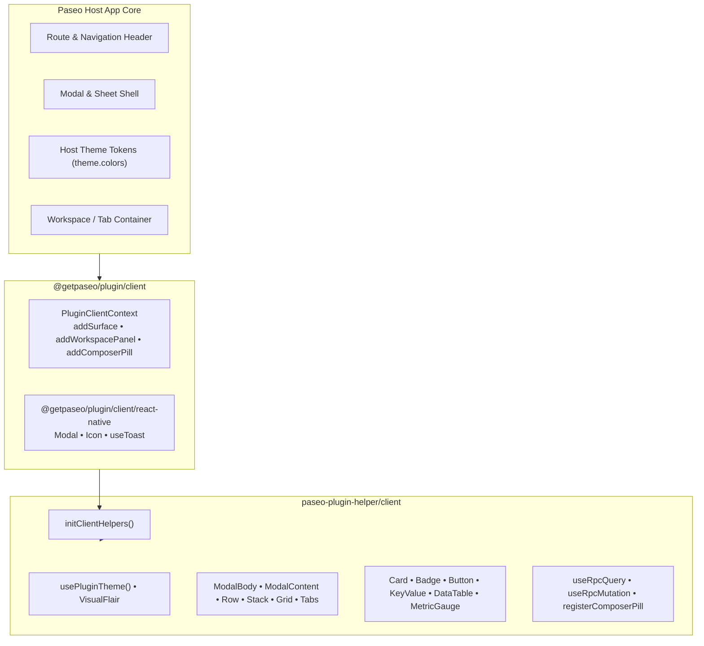

# Paseo Plugin UI: Architecture & Component System

> Complete developer reference for designing, composing, and rendering cross-platform UI across Paseo Desktop (Electron), iOS, Android, and Web browsers.
>
> **Integration context**: This guide documents UI development in the `xpufx/paseo` monorepo (`~/code/paseo`), combining Paseo core host primitives with the [`paseo-plugin-helper/client`](../../../packages/paseo-plugin-helper/README.md) design system, and cross-referencing the [upstream Paseo reference](file:///home/xpufx/code/3rdparty/paseo/paseo/public-docs/plugins/reference.md#host-ui).

---

## Table of Contents

1. [Core UI Design Principles](#1-core-ui-design-principles)
2. [The Two UI Layers: Paseo Core vs. Plugin Helper](#2-the-two-ui-layers)
3. [Client Initialization (`initClientHelpers`)](#3-client-initialization-initclienthelpers)
4. [UI Documentation Suite](#4-ui-documentation-suite)
5. [Quick Navigation & Component Map](#5-quick-navigation--component-map)
6. [Cross-Platform & Mobile Rules Summary](#6-cross-platform--mobile-rules-summary)

---

## 1. Core UI Design Principles

Every plugin UI contribution in Paseo must strictly adhere to four foundational principles:

1. **Theme Awareness Over Color Literals**:
   Paseo ships with multiple light, dark, and custom user-installed themes. Hardcoded hex colors (`#ffffff`, `#000000`, etc.) and unstyled React Native `<Text>` elements break immediately upon theme switching. All text, surfaces, borders, and accents must resolve through `theme.colors` tokens or `usePluginTheme()`.

2. **Mobile-First Responsiveness**:
   Paseo is a multi-platform app running on Desktop, Web, Android, and iOS. UI must scale with `layout.compact` (true on mobile viewports or narrow desktop panes). Touch targets must maintain minimum heights of 44pt on compact screens.

3. **Fluid Layouts Without Fixed Modals**:
   Plugins **do not size their own dialogs**. On desktop, the host allocates a bounded window; on mobile, the host presents an `AdaptiveModalSheet` bottom sheet. Plugins must use fluid containers (`ModalBody`, `flex: 1`, `minHeight: 0`, `width: "100%"`) and never hardcode fixed width/height literals on dialog frames.

4. **Gesture Hierarchy & Non-Nested Scrollers**:
   On mobile, vertical scrolling inside sheets is handled by the host’s bottom-sheet gesture recognizer. Plugins must never nest standard vertical `<ScrollView>`s inside mobile modals, which causes the infamous double-scroll freeze.

---

## 2. The Two UI Layers



1. **Paseo Core SDK (`@getpaseo/plugin/client`)**:
   Provides the foundational runtime entry point (`index.client.tsx`), host registration hooks (`client.addSurface`, `client.addWorkspacePanel`, `client.addComposerPill`), and low-level host UI bridges (`Modal`, `Icon`, `useToast`).
   - See upstream docs: [Upstream Host UI Reference](file:///home/xpufx/code/3rdparty/paseo/paseo/public-docs/plugins/reference.md#host-ui).

2. **Monorepo Design System (`paseo-plugin-helper/client`)**:
   Eliminates boilerplate by providing pre-composed, theme-aware, mobile-optimized React Native UI components, smart layout primitives, automatic modal gesture handling, and React Query data-fetching bridges.

---

## 3. Client Initialization (`initClientHelpers`)

To keep `paseo-plugin-helper` fully decoupled from Paseo SDK version churn, the helper receives host primitives via `initClientHelpers()` once inside `index.client.tsx`:

```tsx
// index.client.tsx
import type { PluginClientContext } from "@getpaseo/plugin/client";
import { Icon, Modal, useToast } from "@getpaseo/plugin/client/react-native";
import { useRpc } from "@getpaseo/plugin/client";
import { initClientHelpers } from "paseo-plugin-helper/client";
import { contributePill } from "./client/pill";
import { contributeSurface } from "./client/surface";

export default function contribute(client: PluginClientContext) {
  // 1. Initialize helper bridge with host primitives
  initClientHelpers({
    Icon,
    Modal,
    useRpc,
    useToast,
  });

  // 2. Register contributions
  const cleanPill = contributePill(client);
  const cleanSurface = contributeSurface(client);

  // 3. Return combined cleanup
  return () => {
    cleanPill?.();
    cleanSurface?.();
  };
}
```

---

## 4. UI Documentation Suite

This documentation suite is organized into specialized topic guides:

- [**Surfaces, Panels & Navigation (`surfaces-and-panels.md`)**](surfaces-and-panels.md)  
  Creating full-screen sidebar views, workspace tabs, Explorer-hosted panels, Command Center (⌘K) actions, and slash commands.
- [**Components & Settings Forms (`components-and-forms.md`)**](components-and-forms.md)  
  Comprehensive catalog of UI primitives (`Card`, `Badge`, `Button`, `DataTable`, `Tabs`, `MetricGauge`), layout primitives (`Row`, `Stack`, `Grid`), modal containers (`ModalBody`, `ModalContent`), and settings forms.
- [**Buttons & Composer Pills (`buttons-and-pills.md`)**](buttons-and-pills.md)  
  Header buttons, popovers, badges, and composer track bar action pills using the automated `registerComposerPill` lifecycle engine.
- [**Timeline Items & Transformers (`timeline-items.md`)**](timeline-items.md)  
  Transforming and decorating built-in agent conversation events, rendering live streaming text with `useRevealedText`, and appending daemon rows with `timeline.append`.
- [**Theming, Tokens & Styling (`theming-and-styling.md`)**](theming-and-styling.md)  
  Theme colors (`theme.colors.*`), elevation/shadows, spacing rungs, custom visual flairs, and registering new themes via `addTheme`.
- [**Mobile & Cross-Platform Rules (`mobile-and-cross-platform.md`)**](mobile-and-cross-platform.md)  
  Mobile modal gesture architecture, avoiding double-scroll bugs, touch targets, DOM isolation in `client/web.ts`, and running conformance audits.

---

## 5. Quick Navigation & Component Map

| Component / Utility | Purpose | Primary Guide |
| :--- | :--- | :--- |
| `<ModalBody>` | Fluid, responsive container solving mobile bottom-sheet nested scroll conflicts. | [Components & Forms](components-and-forms.md) |
| `<ModalContent>` | Drop-in bounded modal wrapper preventing erratic resizing. | [Components & Forms](components-and-forms.md) |
| `<Tabs>` | Edge navigation tab bar with automatic PanResponder gesture capture. | [Components & Forms](components-and-forms.md) |
| `<Card>` | Standardized themed card container with optional header & actions. | [Components & Forms](components-and-forms.md) |
| `<KeyValueGroup>` | Responsive two-column / one-column metadata layout. | [Components & Forms](components-and-forms.md) |
| `<MetricGauge>` | Visual circular or bar gauge for telemetry, CPU, memory, etc. | [Components & Forms](components-and-forms.md) |
| `<DataTable>` | Sortable, responsive tabular data view. | [Components & Forms](components-and-forms.md) |
| `<AboutSection>` | Standard plugin branding, diagnostics copy, and GitHub badge. | [Components & Forms](components-and-forms.md) |
| `<ForgeIcon>` | Unified brand mark resolver for GitHub, GitLab, Forgejo, Gitea, Codeberg. | [Components & Forms](components-and-forms.md) |
| `registerComposerPill` | All-in-one lifecycle registration for agent composer pills. | [Buttons & Pills](buttons-and-pills.md) |
| `registerWorkspacePanel` | Registers workspace tabs and Explorer panels with auto-theming. | [Surfaces & Panels](surfaces-and-panels.md) |

---

## 6. Cross-Platform & Mobile Rules Summary

- **Never use HTML elements**: Use React Native primitives (`View`, `Text`, `Pressable`, `TextInput`, `ScrollView`). No `<div>`, `<span>`, `p`, or `onClick`.
- **Never import DOM libraries**: DOM APIs are strictly forbidden except when isolated in `client/web.ts` and gated behind `Platform.OS === "web"`.
- **Audit your code**:
  ```bash
  # Check for forbidden browser globals & HTML in client/
  rg -n "document\.|window\.|localStorage|navigator\.|<[a-z]+[ >]|className=|onClick=" client/
  ```
