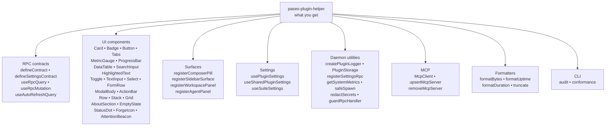

# paseo-plugin-helper

> Developer toolkit, UI design system, and lifecycle primitives for building high-quality Paseo desktop & mobile plugins.

[](LICENSE)
[](https://www.typescriptlang.org/)

`paseo-plugin-helper` provides drop-in solutions for building 3rd-party plugins for [Paseo](https://github.com/getpaseo/paseo). It eliminates boilerplate and provides native-feeling React Native UI components with **mobile-first responsiveness**, **configurable visual flairs**, **zero-dependency MCP client diagnostics**, and **daemon runtime utilities**.

> [!NOTE]
> **Developer Library**: `paseo-plugin-helper` is an npm developer toolkit / SDK used by plugin authors (it is **not** a standalone Paseo plugin itself and cannot be installed directly via `paseo plugin add`).
>
> **Compatibility**: one published build runs on **Paseo >= 0.8.0**. `paseo-plugin-helper/client` imports zero Paseo SDK modules and instead receives `Icon`, `Modal`, `useRpc`, and `useToast` via a single `initClientHelpers()` call in the plugin client entry (see `docs/client.md`). `server`, `shared`, `mcp`, and `testing` carry no SDK imports at all.

---

## Features

- **Structured Logging & Identity**: `createPluginLogger` automatically prints an informative startup banner with plugin identity/version in Paseo GUI logs and keeps log lines unfragmented.
- **Version Resolution & Stamping**: Auto-extracts plugin version from `package.json` + Git tags (`resolvePluginVersion`) and generates static TypeScript versions for client bundles (`stampVersion`).
- **Mobile & Desktop First**: Automatically scales touch targets (min 44pt on iOS/Android or narrow panes), avoids bottom-bar clipping, and reflows layouts between desktop and mobile.
- **Mobile Modal Gesture Architecture**: Solves nested horizontal scrolling and double-scroll issues inside Paseo mobile bottom sheets implicitly using `ModalBody` non-nested rendering and `Tabs` edge navigation.
- **Configurable Visual Flair**: Authors can customize corner radii (`sharp`, `rounded`, `pill`), information density, surface treatments, and brand accents while honoring Paseo's light/dark themes.
- **Inline Actions**: `InlineButton` provides an accessible, compact link/action primitive for timeline cards and dense inline content without bespoke `Pressable` implementations.
- **Shared Forge Marks**: `<ForgeIcon>` resolves a host/kind to one brand mark — Lucide `Github`/`Gitlab`, helper-drawn official mono marks for `Codeberg`/`Forgejo`/`Gitea`, and a generic fallback — so plugins stop duplicating per-forge icon tables.
- **Layout Vocabulary**: `Row`, `Stack`/`VStack`, and `Grid` replace hand-rolled flexbox `View` styles with theme-derived gaps and width-aware wrapping, while `KeyValueGroup` gains `collapse`/`minColumnWidth` so compact surfaces stay multi-column when there is room.
- ℹ️ **Plugin About & Diagnostics Card**: `<AboutSection>` standardizes plugin branding, license tags, version badges, external navigation buttons, 1-tap "Copy Diagnostics" for issue triage, and auto-resolves official GitHub logos from author or repository URLs.
- **Composer Pill Lifecycle Engine**: Complete management of agent subscriptions, pill contributions, and modal states in one function call (`registerComposerPill`).
- **Panels & Surfaces**: One-line registration for sidebar surfaces (`registerSidebarSurface`), panels (`registerWorkspacePanel`, `registerAgentPanel`), and Ctrl+K command-center items (`registerCommandCenterItem`) with automatic theme and flair propagation.
- **Zero-Dependency MCP Client**: Built-in stdio client (`McpClient`) with stderr ring buffering, non-JSON stdout line filtering, cross-platform process tree cleanup, and fallback ping readiness checks.
- **Agent MCP Config Writer**: `upsertMcpServer` and `removeMcpServer` safely register plugin or Gateway MCP servers into Claude Desktop, Claude Code, OpenCode, Cursor, and Gemini configs with JSONC parsing, atomic writes, deep-equality idempotency, and automated backups.
- **React Query RPC Bridge**: `useRpcQuery` & `useRpcMutation` with automatic caching, refetching, and input hashing.
- **Plugin Query & Lifecycle Helpers**: `listPlugins`, `getPluginInfo`, `isPluginRunning`, and `isPluginInstalled` inspect active daemon state and cross-plugin availability with status filtering and built-in TTL caching.
- **End-to-End Settings System**: Type-safe settings flow from Zod schema (`defineSettingsContract`) to atomic daemon storage (`registerSettingsRpc`) and optimistic React Native UI state (`usePluginSettings`).
- **Daemon State & File Storage**: Atomic, temporary-swap file storage (`PluginStorage`) preventing corruption during power cuts or crashes.
- **Security & Redaction**: Deep secret masking for Bearer tokens, API keys, and connection credentials (`redactSecrets`).
- **Deterministic Plugin Audit CLI**: `npx paseo-plugin-helper audit` scans plugin codebases to detect raw bespoke patterns (manual subscriptions, raw filesystem writes, unformatted console logs, raw MCP spawns) and recommends drop-in helper replacements.
- **Mock Testing Harness**: In-memory mocks for `PluginClientContext` and `PluginContext` for testing plugins in Vitest / Jest.

---

## Subpath Imports

To guarantee compliance with Paseo's bundler and compiler rules (no Node builtins in client bundles), import through explicit subpaths:

| Subpath | Target Platform | Description | Docs |
| :--- | :--- | :--- | :--- |
| `paseo-plugin-helper/client` | React Native | UI components, visual flair provider, pill engine, panels, React Query hooks | [docs/client.md](docs/client.md) |
| `paseo-plugin-helper/server` | Node.js 20+ | `createPluginLogger`, `resolvePluginVersion`, `stampVersion`, `getSystemMetrics`, `PluginStorage`, `safeSpawn`, `redactSecrets` | [docs/server.md](docs/server.md) |
| `paseo-plugin-helper/mcp` | Node.js 20+ | Zero-dependency stdio `McpClient`, ring buffer, process tree killer | [docs/mcp.md](docs/mcp.md) |
| `paseo-plugin-helper/cli` | Node.js 20+ | `auditProject` programmatic scanner and reporting | [docs/cli.md](docs/cli.md) |
| `paseo-plugin-helper/shared` | Universal | `defineContract`, formatters (`formatBytes`, `formatUptime`, `resolveMetricStatus`) | [docs/shared.md](docs/shared.md) |
| `paseo-plugin-helper/testing` | Universal | Mock client and server contexts for unit and integration testing | [docs/testing.md](docs/testing.md) |

## Capability Map

One picture of what the library gives you — scan down, spot the verb you need, grep the docs for it:



---

## Bundle Posture (Tree-Shaking & Minification)

Builds run through tsup with `treeshake: true` and `minify: true` (sourcemaps on, `.d.ts` unaffected); the package declares `"sideEffects": false` so bundlers may drop unused modules. All module-level state is inert until an exported function runs: no CSS/polyfill imports, no DOM/global writes at import time (the icon name-cache `Set` and `globalThis`/`process.env` reads all live inside functions), and every `console.*` call sits behind a runtime code path. Import via the subpaths above to narrow what each plugin pulls.

What the helper cannot decide: final per-plugin bundle size is set by the Paseo daemon's own esbuild pass at plugin install time (its minify/tree-shaking settings are host-side). What we guarantee: shipped `dist` is already minified, side-effect-free per module, and split by entry point so the daemon bundler has the smallest possible input to work with.

---

## Installation

Install directly from GitHub:

```bash
# npm
npm install github:xpufx/paseo-plugin-helper

# pnpm
pnpm add github:xpufx/paseo-plugin-helper
```

Or in your plugin's `package.json`:
```json
{
  "dependencies": {
    "paseo-plugin-helper": "github:xpufx/paseo-plugin-helper"
  }
}
```

> [!TIP]
> The repository includes an automated `prepare` build lifecycle script. When npm/pnpm installs from GitHub, it automatically compiles the dual ESM/CJS bundles and TypeScript declaration maps on-the-fly.

---

## Quickstart

### 1. Client: Composer Pill & UI Primitives

```tsx
import type { PluginClientContribution } from "@getpaseo/plugin";
import {
  registerComposerPill,
  ModalBody,
  Card,
  Button,
  Badge,
  KeyValue,
  TextInput,
  Toggle,
  Collapsible,
  useRpcQuery,
} from "paseo-plugin-helper/client";
import { myStatusContract } from "./contracts.js";

export const contributeClient: PluginClientContribution = (client) => {
  return registerComposerPill(client, {
    id: "my-plugin",
    title: "System Stats",
    icon: "Activity",
    flair: {
      radius: "rounded",          // "sharp" | "rounded" | "pill"
      density: "comfortable",     // "compact" | "comfortable" | "spacious"
      accentColor: "#10b981",     // Custom brand emerald accent
    },
    renderModal({ agentId, close }) {
      const { data, isLoading } = useRpcQuery(myStatusContract, { agentId });

      return (
        <ModalBody>
          <Card>
            <KeyValue label="Status" value={data?.status} />
            <KeyValue label="Uptime" value={data?.uptime} />
            <Badge variant="success" label="Healthy" />
          </Card>
          <Button variant="secondary" label="Dismiss" onPress={close} />
        </ModalBody>
      );
    },
  });
};
```

### 1b. Style Guide: Tokens Over Literals

```tsx
import {
  usePluginTheme,   // colors, fonts, padding, resolveRadius, isCompact
  spacing,          // xxs:2 xs:4 sm:8 md:12 lg:16 xl:24
  resolveElevation, // "none" | "sm" | "md" | "lg" -> shadow + elevation
} from "paseo-plugin-helper/client";

function Row() {
  const { colors, padding, isCompact } = usePluginTheme();
  return (
    <View
      style={{
        backgroundColor: colors.surface1,   // never a hex literal
        paddingHorizontal: padding.horizontal,
        paddingVertical: isCompact ? spacing.xs : spacing.sm, // one rung down in compact
        ...resolveElevation("sm"),          // no hand-rolled shadowColor
      }}
    />
  );
}
```

Rules: `Card`, `KeyValue`, `Tabs`, and `ModalBody` already follow this scale,
so compose them instead of re-implementing wrappers. `PluginThemeProvider`
merges static defaults, live Paseo 0.8 CSS variables (`--background`,
`--foreground`, `--muted`, `--accent`, `--border`), and the injected host
theme in that order, so surfaces track host dark/light switches with no
plugin code.

### 1c. Composing Layout: `Row`, `Stack`, `Grid`

Stop hand-rolling `<View style={{ flexDirection: "row", gap }}>` and stacking
everything one-per-line. The three layout primitives are thin flexbox wrappers
whose default `gap` comes from the active theme
(`usePluginTheme().padding.gap`), so spacing tracks host density with no
literals:

```tsx
import { Button, Grid, MetricGauge, Row, Stack, StatusDot, Text } from "paseo-plugin-helper/client";

// Horizontal: status dot + title + action on one line.
<Row align="center" gap="sm">
  <StatusDot variant="success" />
  <Text>Build passing</Text>
  <Button label="Retry" variant="ghost" size="sm" onPress={retry} />
</Row>

// Vertical: the deliberate column default.
<Stack>
  <Text>Title</Text>
  <Text>Subtitle</Text>
</Stack>

// Width-aware grid: four-up when it fits, wrapping down as the surface narrows.
<Grid columns={4} minColumnWidth={180}>
  <MetricGauge value={12} label="CPU" />
  <MetricGauge value={64} label="RAM" />
</Grid>
```

`Row` accepts `wrap`, `align`, and `justify`; `Stack` (alias `VStack`) is the
column counterpart. `gap` is a spacing token (`"xs" | "sm" | "md" | "lg" | "xl"`)
or a raw px number, defaulting to the theme gap. `Grid` never collapses to a
single column: with `minColumnWidth` it uses as many columns as fit (capped by
`columns`) and wraps the rest.

`<KeyValueGroup>` keeps its compact-aware default (one column on a compact
surface) for existing consumers, but now exposes `collapse` and `minColumnWidth`:

```tsx
// Stay 2-up even in a compact popover, as long as each cell has 220px.
<KeyValueGroup columns={2} collapse="never" minColumnWidth={220}>
  <KeyValue layout="inline" label="Version" value={sha} mono />
  <KeyValue layout="inline" label="Remote" value={remote} mono />
</KeyValueGroup>
```

---

```ts
import { McpClient } from "paseo-plugin-helper/mcp";

// Connect to any local or bundled MCP server over stdio
const client = McpClient.forStdio("node", ["./dist/mcp-server.js"]);

const ping = await client.ping({ mode: "tools" });
if (ping.healthy) {
  const tools = await client.listTools();
  console.log(`MCP server online. Latency: ${ping.latencyMs}ms. Tools:`, tools);
} else {
  console.error(`MCP server offline: ${ping.error}\nRecent stderr:\n${ping.stderr}`);
}

await client.close();
```

---

### 3. Server: Atomic Storage & Safe Process Execution

```ts
import type { PluginContribution } from "@getpaseo/plugin";
import { createPluginLogger, PluginStorage, safeSpawn } from "paseo-plugin-helper/server";
import { myStatusContract } from "./contracts.js";

// Emits startup banner: "[my-plugin v0.1.0] Initializing plugin..."
const log = createPluginLogger("my-plugin", { version: "0.1.0" });

interface PluginState {
  lastRun: string;
  runCount: number;
}

const storage = new PluginStorage<PluginState>("my-plugin", "state.json", {
  defaultData: { lastRun: "", runCount: 0 },
});

export const contributePlugin: PluginContribution = (plugin) => {
  plugin.handle(myStatusContract, async (input) => {
    log.info("Processing status request", { target: input.target });
    const { stdout } = await safeSpawn("uptime", [], { timeoutMs: 3000 });

    storage.update((prev) => ({
      lastRun: new Date().toISOString(),
      runCount: prev.runCount + 1,
    }));

    return {
      uptime: stdout,
      status: "online",
    };
  });

  return () => {};
};
```

---

## Modal Size Contract

Modals do not size themselves. Every plugin modal takes the **host-allocated
dialog size** and is fluid within it:

- **Fill it, don't dictate it**: `ModalBody` is `flex: 1 / minHeight: 0 /
  width: "100%"`; keep every wrapper between the host and `ModalBody` fluid too.
- **No content-driven resizing**: a root that sizes to its children makes the
  dialog visibly resize/redraw as data loads or grows. That is the anti-pattern
  this contract removes.
- **No hardcoded modal dimensions**: no `minWidth`/`minHeight`/fixed `width`/
  `height` literals on modal or surface containers. Shrinkable text uses
  `minWidth: 0` + `flexShrink: 1`.
- **No nested scrollers**: the host owns the outer scroll on desktop and the
  bottom sheet owns it on mobile; use `ModalBody` instead of adding another
  `ScrollView`.

On desktop the host presents a bounded dialog and owns scrolling; on mobile the
host presents an `AdaptiveModalSheet` bottom sheet that owns the viewport and
sheet gesture. Plugins get neither to guess: they just stay fluid inside
whatever the host allocates.

When a data-dense modal genuinely needs more room, pass the one documented
preset `ModalBody size="large"` (desktop-only wide extent; ignored on mobile
sheets and composer popovers) instead of adding a per-plugin width literal. In
the other direction, `ModalBody maxContentWidth={n}` caps and centers the
content column so settings/forms do not stretch edge-to-edge on large viewports;
both are helper-owned, so plugin code adds no width literals. See
[`docs/client.md`](docs/client.md) for the full contract and the `ModalBody`
API.

### Opening your own `<Modal>`: use `<ModalContent>`, not `<Modal.Content>`

Plugins that render their own host `<Modal>` must not hand it the raw host
`<Modal.Content>`. Paseo's host defaults `Modal.Content` to `scrollable`, which
renders a **content-sized** desktop card — so the dialog resizes on every data
change (the inconsistency between `top` and the other surfaces).

`ModalContent` is the helper-owned replacement: it always passes
`scrollable={false}` (the host then allocates a bounded dialog) and renders the
shared `ModalBody` contract inside it, so a plugin using it cannot end up
content-sized.

```tsx
import { Modal } from "@getpaseo/plugin/client/react-native";
import { ModalContent } from "paseo-plugin-helper/client";

<Modal title="My modal" open={open} onOpenChange={setOpen}>
  <ModalContent>{/* content */}</ModalContent>
</Modal>;
```

`ModalContent` accepts every `ModalBody` prop, so `size?: "default" | "large"`
stays the only size escape hatch. Raw `<Modal.Content>` is only for non-plugin
surfaces; plugin client code should use `ModalContent`.

The bounded host content view supplies no scroller, so `ModalContent` forces
`ModalBody scrollMode="always"`: the helper owns the one scroll region on every
surface (desktop included) and the bounded dialog scrolls instead of clipping.

## Mobile Modal Gesture Architecture & `<Tabs>`

### The Challenge with Nested Scrolling in Paseo Modals

On mobile viewports (`isCompact: true`), Paseo renders modal dialogs using an `@gorhom/bottom-sheet` component (`AdaptiveModalSheet`). Under the hood, this sheet attaches a root `PanGestureHandler` to manage dragging, detents, and swipe-to-dismiss behavior.

In standard React Native, nesting a horizontal `<ScrollView>` inside a gesture-driven bottom sheet creates immediate conflicts:
1. **Touch Hijacking**: The parent bottom sheet's gesture recognizer claims ownership of all touch streams. When a user attempts to swipe a nested horizontal ribbon, the parent gesture handler intercepts the touch events and cancels them.
2. **Double ScrollView Trap**: Paseo's modal host already wraps plugin content in a `BottomSheetScrollView` on mobile. If a plugin wraps its modal content in another vertical `<ScrollView>`, the nested views fight for touch ownership, locking scrolling velocity and swallowing gestures.

### How `paseo-plugin-helper` Solves This Automatically

`paseo-plugin-helper` provides built-in defenses so plugin developers do not need to invent complex workarounds:

1. **Non-Nested `<ModalBody>` on Mobile**:
   [`ModalBody`](src/client/layout/ModalBody.tsx) checks `isCompact`. On desktop, it renders a standard React Native `<ScrollView>`. On mobile, it automatically renders a responsive `<View>` with safe bottom insets, deferring vertical scrolling directly to Paseo's host `BottomSheetScrollView` without creating a double-scroll trap.

2. **Universal Edge Navigation in `<Tabs>`**:
   [`Tabs`](src/client/components/Tabs.tsx) provides two responsive modes:
   - **`mode="fit"` (Default)**: Tabs stretch to fit the viewport width. Authors can provide `shortLabel` on any tab item (e.g. `label: "Interactive Controls"`, `shortLabel: "Controls"`), allowing tabs to fit cleanly on narrow mobile screens without truncation.
   - **`mode="scroll"`**: If tabs exceed the container width, elevated chevron buttons (`ChevronLeft` and `ChevronRight`) appear on the track edges on both desktop and mobile. Tapping an arrow smoothly advances the tab track by 70% of the visible viewport width.
   - **Gesture Capture**: `<Tabs>` attaches a `PanResponder` configured with `onMoveShouldSetPanResponderCapture`. When horizontal movement is detected, it claims the gesture during the capture phase before the parent bottom sheet can cancel it.

#### Usage Example:

```tsx
import { Tabs, type TabItem } from "paseo-plugin-helper/client";

const tabs: TabItem[] = [
  { id: "overview", label: "System Overview", shortLabel: "Overview", icon: "Cpu" },
  { id: "storage", label: "Storage Volumes", shortLabel: "Storage", icon: "HardDrive" },
  { id: "network", label: "Network Diagnostics", shortLabel: "Net", icon: "Activity" },
  { id: "logs", label: "Realtime Logs", shortLabel: "Logs", icon: "Terminal", badge: 3 },
];

<Tabs
  tabs={tabs}
  activeTab={activeTab}
  onTabChange={setActiveTab}
  mode="auto" // "auto" fits on mobile with shortLabel; use "scroll" for ribbon navigation
/>
```

---

## Interactive Showcase Demo

Live Showcase coverage lives in the monorepo's `plugins/demo` conformance testbed (all components, responsive behaviors, Flair Studio, `AboutSection` branding). The legacy `demo/` reference tree was removed.

## Documentation

Comprehensive API and module documentation:

- [Client Design System & Lifecycles (`docs/client.md`)](docs/client.md)
- [Server Daemon Utilities (`docs/server.md`)](docs/server.md)
- [MCP Client & Transports (`docs/mcp.md`)](docs/mcp.md)
- [Shared Types & Formatters (`docs/shared.md`)](docs/shared.md)
- [Testing Harness (`docs/testing.md`)](docs/testing.md)

---

## Known Users of the Library

Plugins powered by `paseo-plugin-helper`:

- [**`paseo-top`**](https://github.com/xpufx/paseo/tree/main/plugins/top) – Real-time system resource monitor (CPU, memory, load average) for Paseo composers with responsive charts, cards, and warning thresholds.
- [**`paseo-helper-demo`**](https://github.com/xpufx/paseo-helper-demo) – Interactive showcase and reference implementation for the helper: live pill, metrics, typed RPC actions, and persisted settings.
- [**`paseo-forges`**](https://github.com/xpufx/paseo-forges) (coming soon) – Work with Forge/Gitea-family issues from inside Paseo via the embedded fetch API client.
- [**`paseo-mcp-tools`**](https://github.com/xpufx/paseo-mcp-tools) – Inline UI for checking MCP servers available to an agent session, with live probes verifying actual session inclusion.
- [**`paseo-slash`**](https://github.com/xpufx/paseo-slash) (coming soon) – Slash commands and macros with an interactive console, registered straight into the composer.
- [**`paseo-x-comms`**](https://github.com/xpufx/paseo-x-comms) – Cross-daemon agent conversations over Paseo Relay, bundling its own MCP server.
- [**`twofado`**](https://github.com/xpufx/twofado) (coming soon) – Out-of-band human approval for agent command execution: the agent petitions, your phone buzzes over Telegram, you tap, it runs.

---

## My other Paseo plugins

More from the same author: [xpufx.github.io/#paseo](https://xpufx.github.io/#paseo)

---

## License

MIT © [xpufx](LICENSE)
