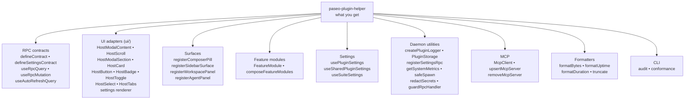

# paseo-plugin-helper (deprecated)

> Developer toolkit and lifecycle primitives for building high-quality Paseo desktop & mobile plugins.

[](LICENSE)
[](https://www.typescriptlang.org/)

`paseo-plugin-helper` provides drop-in solutions for building 3rd-party plugins for [Paseo](https://github.com/getpaseo/paseo): headless RPC/query/settings hooks, UI-free lifecycle registration engines, host-delegating UI adapters, a **zero-dependency MCP client**, and **daemon runtime utilities**.

> [!NOTE]
> **Developer Library Only (Deprecated as a Plugin)**: `paseo-plugin-helper` is deprecated as an installable plugin and is not published as one. It serves strictly as an npm developer library, CLI toolkit, and SDK used by plugin authors (it cannot be installed via `paseo plugin add`).
>
> **Compatibility**: one published build runs on **Paseo >= 0.8.0**. The client-safe entries (`core`, `lifecycle`, `ui`) import zero Paseo SDK modules and receive `Icon`, `Modal`, `useRpc`, and `useToast` via a single `initClientHelpers()` call in the plugin client entry. `server`, `shared`, `mcp`, and `testing` carry no SDK imports at all.

> [!IMPORTANT]
> **The bespoke `client/` UI kit was removed (paseo#847, paseo#938).** The UI
> components, theme/flair system, layout primitives, `tickets`, `ForgeIcon`,
> `custom-pills` and the `settings-screen` barrel no longer ship, and the
> `paseo-plugin-helper/client` subpath no longer exists. Build plugin UI from
> the host SDK (`@getpaseo/plugin/client/react-native`,
> `@getpaseo/plugin/client/ui`) plus the host-delegating
> `paseo-plugin-helper/ui` adapters — see the
> [migration guide](docs/client-migration.md). Headless hooks and the host seam
> live in `paseo-plugin-helper/core`; the registration engines
> (`registerComposerPill`, `registerSidebarSurface`, `registerWorkspacePanel`,
> `registerAgentPanel`) and clipboard/haptics live in
> `paseo-plugin-helper/lifecycle`.
>
> Registration wrappers (`registerSidebarSurface`, `registerWorkspacePanel`,
> `registerAgentPanel`, `registerComposerPill`) mount the `ui/`
> `HostThemeProvider` for their subtree, forwarding the host `theme` to every
> `paseo-plugin-helper/ui` adapter below. Rendering `ui/` adapters outside a
> registrar requires mounting `HostThemeProvider` yourself — without it they
> fall back to a static dark palette, which masks the missing provider on a
> light desktop.

---

## Features

- **Structured Logging & Identity**: `createPluginLogger` automatically prints an informative startup banner with plugin identity/version in Paseo GUI logs and keeps log lines unfragmented.
- **Version Resolution & Stamping**: Auto-extracts plugin version from `package.json` + Git tags (`resolvePluginVersion`) and generates static TypeScript versions for client bundles (`stampVersion`).
- **Host-Delegating UI Adapters**: `paseo-plugin-helper/ui` ships opinion-free adapters (`HostModalContent`, `HostScroll`, `HostModalSection`, `HostCard`, `HostButton`, `HostBadge`, `HostTabs`, controls, and a settings renderer) that compose the host SDK primitives and read host theme colors — no bespoke design system.
- **Host Theme Propagation**: registration wrappers mount `HostThemeProvider` so `ui/` adapters track the host light/dark theme; outside a registrar, mount it yourself.
- **Shared Forge Marks**: `resolveForgeMark` (in `paseo-plugin-helper/shared`) maps a host/kind to one brand-mark descriptor, so plugins stop duplicating per-forge icon tables.
- **Composer Pill Lifecycle Engine**: Complete management of agent subscriptions, pill contributions, and modal states in one function call (`registerComposerPill`).
- **Composable Feature Modules**: `FeatureModule` + `composeFeatureModules` assemble a plugin from droppable units of functionality — each contributes server/client behavior, returns an idempotent disposer, and is torn down in reverse order with partial-failure cleanup and eager composition validation (see [docs/features.md](docs/features.md)).
- **Panels & Surfaces**: One-line registration for sidebar surfaces (`registerSidebarSurface`), panels (`registerWorkspacePanel`, `registerAgentPanel`), and Ctrl+K command-center items (`registerCommandCenterItem`) with automatic host-theme and flair propagation.
- **Zero-Dependency MCP Client**: Built-in stdio client (`McpClient`) with stderr ring buffering, non-JSON stdout line filtering, cross-platform process tree cleanup, and fallback ping readiness checks.
- **Agent MCP Config Writer**: `upsertMcpServer` and `removeMcpServer` safely register plugin or Gateway MCP servers into Claude Desktop, Claude Code, OpenCode, Cursor, and Gemini configs with JSONC parsing, atomic writes, deep-equality idempotency, and automated backups.
- **React Query RPC Bridge**: `useRpcQuery` & `useRpcMutation` with automatic caching, refetching, and input hashing.
- **Plugin Registry & Presence**: `listPlugins(context)` and `isPluginInstalled(context, id)` detect and enumerate other plugins through the sanctioned daemon channel (a `context.paseo.plugins` SDK surface when present, else the daemon's `paseo plugin ls --json` RPC). Absence tolerates to `[]`/`false` — never throws — so optional surfaces can be gated on a companion plugin. The legacy full-metadata helpers (`listPlugins()` / `getPluginInfo` / `isPluginRunning`) remain for plugin-manager use.
- **End-to-End Settings System**: Type-safe settings flow from Zod schema (`defineSettingsContract`) to atomic daemon storage (`registerSettingsRpc`) and optimistic React Native UI state (`usePluginSettings`).
- **Daemon State & File Storage**: Atomic, temporary-swap file storage (`PluginStorage`) preventing corruption during power cuts or crashes.
- **Security & Redaction**: Deep secret masking for Bearer tokens, API keys, and connection credentials (`redactSecrets`).
- **Deterministic Plugin Audit CLI**: `npx paseo-plugin-helper audit` scans plugin codebases to detect raw bespoke patterns (manual subscriptions, raw filesystem writes, unformatted console logs, raw MCP spawns) and recommends drop-in helper replacements.
- **Mock Testing Harness**: In-memory mocks for `PluginClientContext` and `PluginContext` for testing plugins in Vitest / Jest.

---

## Subpath Imports

To guarantee compliance with Paseo's bundler and compiler rules (no Node builtins in client bundles), import through explicit subpaths:

| Subpath | Target Platform | Description | Docs |
| :--- | :--- | :--- | :--- |
| `paseo-plugin-helper/lifecycle` | React Native | UI-free registration engines (`registerComposerPill`, `registerSidebarSurface`, `registerWorkspacePanel`, `registerAgentPanel`), clipboard, haptics, host theme context | [docs/client-migration.md](docs/client-migration.md) |
| `paseo-plugin-helper/core` | Universal | Headless client-safe runtime: host seam (`initClientHelpers`), RPC contracts, query/settings hooks, snapshot helpers (no `react-native`, no `node:*`) | [docs/client-migration.md](docs/client-migration.md) |
| `paseo-plugin-helper/ui` | React Native | Host-delegating UI adapters (`HostModalContent`, `HostScroll`, `HostModalSection`, `Host*` controls, settings renderer) | [docs/client-migration.md](docs/client-migration.md) |
| `paseo-plugin-helper/server` | Node.js 20+ | `createPluginLogger`, `resolvePluginVersion`, `stampVersion`, `getSystemMetrics`, `PluginStorage`, `safeSpawn`, `redactSecrets` | [docs/server.md](docs/server.md) |
| `paseo-plugin-helper/mcp` | Node.js 20+ | Zero-dependency stdio `McpClient`, ring buffer, process tree killer | [docs/mcp.md](docs/mcp.md) |
| `paseo-plugin-helper/cli` | Node.js 20+ | `auditProject` programmatic scanner and reporting | [docs/cli.md](docs/cli.md) |
| `paseo-plugin-helper/shared` | Universal | `defineContract`, `FeatureModule` + `composeFeatureModules`, formatters (`formatBytes`, `formatUptime`, `resolveMetricStatus`) | [docs/shared.md](docs/shared.md) |
| `paseo-plugin-helper/testing` | Universal | Mock client and server contexts for unit and integration testing | [docs/testing.md](docs/testing.md) |

## Capability Map

One picture of what the library gives you — scan down, spot the verb you need, grep the docs for it:


```mermaid
flowchart TB
    H["paseo-plugin-helper\nwhat you get"]

    H --> RPC["RPC contracts\ndefineContract • defineSettingsContract\nuseRpcQuery • useRpcMutation\nuseAutoRefreshQuery"]
    H --> UI["UI adapters (ui/)\nHostModalContent • HostScroll\nHostModalSection • HostCard\nHostButton • HostBadge • HostToggle\nHostSelect • HostTabs\nsettings renderer"]
    H --> PILL["Surfaces\nregisterComposerPill\nregisterSidebarSurface\nregisterWorkspacePanel\nregisterAgentPanel"]
    H --> MOD["Feature modules\nFeatureModule • composeFeatureModules"]
    H --> SET["Settings\nusePluginSettings\nuseSharedPluginSettings\nuseSuiteSettings"]
    H --> SRV["Daemon utilities\ncreatePluginLogger • PluginStorage\nregisterSettingsRpc\ngetSystemMetrics • safeSpawn\nredactSecrets • guardRpcHandler"]
    H --> MCP["MCP\nMcpClient • upsertMcpServer\nremoveMcpServer"]
    H --> FMT["Formatters\nformatBytes • formatUptime\nformatDuration • truncate"]
    H --> CLI["CLI\naudit • conformance"]
```

---

## Bundle Posture (Tree-Shaking & Minification)

Builds run through tsup with `treeshake: true` and `minify: true` (sourcemaps on, `.d.ts` unaffected); the package declares `"sideEffects": false` so bundlers may drop unused modules. All module-level state is inert until an exported function runs: no CSS/polyfill imports, no DOM/global writes at import time (the icon name-cache `Set` and `globalThis`/`process.env` reads all live inside functions), and every `console.*` call sits behind a runtime code path. Import via the subpaths above to narrow what each plugin pulls.

What the helper cannot decide: final per-plugin bundle size is set by the Paseo daemon's own esbuild pass at plugin install time (its minify/tree-shaking settings are host-side). What we guarantee: shipped `dist` is already minified, side-effect-free per module, and split by entry point so the daemon bundler has the smallest possible input to work with.

---

## Installation

Install directly from GitHub:

```bash
# npm
npm install github:xpufx/paseo-plugin-helper

# pnpm
pnpm add github:xpufx/paseo-plugin-helper
```

Or in your plugin's `package.json`:
```json
{
  "dependencies": {
    "paseo-plugin-helper": "github:xpufx/paseo-plugin-helper"
  }
}
```

> [!TIP]
> The repository includes an automated `prepare` build lifecycle script. When npm/pnpm installs from GitHub, it automatically compiles the dual ESM/CJS bundles and TypeScript declaration maps on-the-fly.

---

## Quickstart

### 1. Client: Composer Pill from the lifecycle + ui entries

```tsx
import type { PluginClientContribution } from "@getpaseo/plugin";
import { useRpc } from "@getpaseo/plugin/client";
import { Icon, Modal, useToast } from "@getpaseo/plugin/client/react-native";
import { initClientHelpers, useRpcQuery } from "paseo-plugin-helper/core";
import { registerComposerPill } from "paseo-plugin-helper/lifecycle";
import { HostCard, HostBadge, HostModalSection } from "paseo-plugin-helper/ui";
import { myStatusContract } from "./contracts.js";

initClientHelpers({ Icon, Modal, useRpc, useToast });

export const contributeClient: PluginClientContribution = (client) => {
  return registerComposerPill(client, {
    id: "my-plugin",
    title: "System Stats",
    icon: "Activity",
    renderModal({ agentId, close }) {
      const { data } = useRpcQuery(myStatusContract, { agentId });

      return (
        <HostModalSection>
          <HostCard>
            <HostBadge variant="success" label={data?.status ?? "…"} />
          </HostCard>
        </HostModalSection>
      );
    },
  });
};
```

The `ui/` adapters take no theme prop: every registration wrapper mounts the
host `HostThemeProvider` for its subtree, so the adapters read the host `theme`
colors directly. Outside a registration wrapper, mount `HostThemeProvider`
yourself. Hand-rolled layout, pressables, and status visuals stay local to the
plugin — the helper no longer ships a bespoke design system.

---

```ts
import { McpClient } from "paseo-plugin-helper/mcp";

// Connect to any local or bundled MCP server over stdio
const client = McpClient.forStdio("node", ["./dist/mcp-server.js"]);

const ping = await client.ping({ mode: "tools" });
if (ping.healthy) {
  const tools = await client.listTools();
  console.log(`MCP server online. Latency: ${ping.latencyMs}ms. Tools:`, tools);
} else {
  console.error(`MCP server offline: ${ping.error}\nRecent stderr:\n${ping.stderr}`);
}

await client.close();
```

---

### 3. Server: Atomic Storage & Safe Process Execution

```ts
import type { PluginContribution } from "@getpaseo/plugin";
import { createPluginLogger, PluginStorage, safeSpawn } from "paseo-plugin-helper/server";
import { myStatusContract } from "./contracts.js";

// Emits startup banner: "[my-plugin v0.1.0] Initializing plugin..."
const log = createPluginLogger("my-plugin", { version: "0.1.0" });

interface PluginState {
  lastRun: string;
  runCount: number;
}

const storage = new PluginStorage<PluginState>("my-plugin", "state.json", {
  defaultData: { lastRun: "", runCount: 0 },
});

export const contributePlugin: PluginContribution = (plugin) => {
  plugin.handle(myStatusContract, async (input) => {
    log.info("Processing status request", { target: input.target });
    const { stdout } = await safeSpawn("uptime", [], { timeoutMs: 3000 });

    storage.update((prev) => ({
      lastRun: new Date().toISOString(),
      runCount: prev.runCount + 1,
    }));

    return {
      uptime: stdout,
      status: "online",
    };
  });

  return () => {};
};
```

---

## Composable Feature Modules

A plugin entry can be assembled from `FeatureModule`s instead of one monolithic
`contribute` body. Each module owns one concern, contributes to the server
and/or client side, and returns an **idempotent disposer**. A plugin entry
composes them and returns the combined disposer Paseo calls on unload.

```ts
import type { PluginClientContext } from "@getpaseo/plugin/client";
import type { PluginServerContext } from "@getpaseo/plugin/server";
import { composeFeatureModules } from "paseo-plugin-helper/shared";
import { customPills } from "./features/custom-pills.js";
import { timelineTelemetry } from "./features/timeline-telemetry.js";

const features = composeFeatureModules<PluginServerContext, PluginClientContext>([
  customPills,
  timelineTelemetry,
]);

export function contributeServer(server: PluginServerContext) {
  return features.contributeServer(server);
}

export function contributeClient(client: PluginClientContext) {
  return features.contributeClient(client);
}
```

Lifecycle guarantees: contributions run in composition order, teardown runs in
reverse order, the combined disposer is idempotent, a failed contribution tears
down what already mounted, and duplicate module ids / contract names throw at
composition time. This phase is additive — existing plugins are unchanged. See
[docs/features.md](docs/features.md) for the full contract.

---

## Plugin Registry & Presence (`listPlugins(context)`, `isPluginInstalled(context, id)`)

Detect and enumerate other installed plugins through the **sanctioned daemon channel** — never by
touching host-private files. Use this to enable/disable a surface, or to offer an
"if you had plugin X you could also…" affordance, and tolerate absence gracefully.

```ts
import { listPlugins, isPluginInstalled } from "paseo-plugin-helper/server";

export default function contribute(server) {
  server.handle(myContract, async (input, context) => {
    // Usable = present + enabled + running. Absence -> false, never throws.
    const xComms = await isPluginInstalled(context, "x-comms");

    // Everything the daemon reports, normalized.
    const presence = await listPlugins(context); // [{ id, status, enabled }, ...]

    return { xComms, presence };
  });
}
```

- **Resolution order**: a `context.paseo.plugins.list()` SDK surface when the host exposes one,
  otherwise the daemon's existing `paseo plugin ls --json` query.
- **Tolerant by contract**: no context, missing SDK surface, unreachable daemon, or a malformed
  payload all resolve to `[]` / `false` — a missing companion plugin never breaks the caller.
- **Full-metadata variants** (`listPlugins()` / `getPluginInfo` / `isPluginEnabled` /
  `isPluginRunning`) remain for plugin-manager use where `path`/`source`/`commit` matter; they use
  the CLI with a `~/.paseo/config.json` fallback.

> [!WARNING]
> **Anti-patterns** — do not detect plugins by scanning `~/.paseo/plugins/`, reading/parsing
> `sources.json`, or probing plugin data directories. Those are host-private, drift across daemon
> versions, and answer "is a directory present" rather than "is the plugin usable". The audit CLI
> flags this (rule `no-filesystem-plugin-probing`).

---

## Modal Size Contract

Modals do not size themselves. Every plugin modal takes the **host-allocated
dialog size** and is fluid within it:

- **Fill it, don't dictate it**: keep every wrapper between the host and your
  content fluid; a root that sizes to its children makes the dialog visibly
  resize/redraw as data loads.
- **No hardcoded modal dimensions**: no `minWidth`/`minHeight`/fixed
  `width`/`height` literals on modal or surface containers. Shrinkable text uses
  `minWidth: 0` + `flexShrink: 1`.
- **No nested scrollers**: the host owns the outer scroll on desktop and the
  bottom sheet owns it on mobile.

Use `HostModalContent` from `paseo-plugin-helper/ui` inside your own host
`<Modal>`. For a composer-pill `renderModal` body the host already supplies the
one `<Modal.Content>`, so wrap content in `HostModalSection`. Use `HostScroll`
only on surfaces where the host supplies no scroller. The adapters never force
`scrollable={false}`, never cap width, and never add a second scroller — see
[`docs/client-migration.md`](docs/client-migration.md).

## Mobile modals

On mobile Paseo renders modal dialogs in an `AdaptiveModalSheet` bottom sheet
that owns the viewport and the sheet gesture, and the host wraps plugin content
in a `BottomSheetScrollView`. Do not nest a vertical `ScrollView` inside it:
use `HostModalContent` / `HostModalSection` (or plain views) and let the host
own the single scroll region.

---

## Interactive Showcase Demo

Live Showcase coverage lives in the monorepo's `plugins/demo` conformance testbed (host-delegating `ui/` adapters, local composition, typed RPC actions, and persisted settings). The legacy `demo/` reference tree was removed.

## Documentation

Comprehensive API and module documentation:

- [Client migration guide (`docs/client-migration.md`)](docs/client-migration.md) — `core`, `lifecycle`, and `ui`
- [Server Daemon Utilities (`docs/server.md`)](docs/server.md)
- [MCP Client & Transports (`docs/mcp.md`)](docs/mcp.md)
- [Shared Types & Formatters (`docs/shared.md`)](docs/shared.md)
- [Composable Feature Modules (`docs/features.md`)](docs/features.md)
- [Testing Harness (`docs/testing.md`)](docs/testing.md)

---

## Known Users of the Library

Plugins powered by `paseo-plugin-helper`:

- [**`paseo-top`**](https://github.com/xpufx/paseo/tree/main/plugins/top) – Real-time system resource monitor (CPU, memory, load average) for Paseo composers with responsive charts, cards, and warning thresholds.
- [**`paseo-helper-demo`**](https://github.com/xpufx/paseo-helper-demo) – Interactive showcase and reference implementation for the helper: live pill, metrics, typed RPC actions, and persisted settings.
- [**`paseo-forges`**](https://github.com/xpufx/paseo-forges) (coming soon) – Work with Forge/Gitea-family issues from inside Paseo via the embedded fetch API client.
- [**`paseo-mcp-tools`**](https://github.com/xpufx/paseo-mcp-tools) – Inline UI for checking MCP servers available to an agent session, with live probes verifying actual session inclusion.
- [**`paseo-slash`**](https://github.com/xpufx/paseo-slash) (coming soon) – Slash commands and macros with an interactive console, registered straight into the composer.
- [**`paseo-x-comms`**](https://github.com/xpufx/paseo-x-comms) – Cross-daemon agent conversations over Paseo Relay, bundling its own MCP server.
- [**`twofado`**](https://github.com/xpufx/twofado) (coming soon) – Out-of-band human approval for agent command execution: the agent petitions, your phone buzzes over Telegram, you tap, it runs.

---

## My other Paseo plugins

More from the same author: [xpufx.github.io/#paseo](https://xpufx.github.io/#paseo)

---

## License

MIT © [xpufx](LICENSE)
