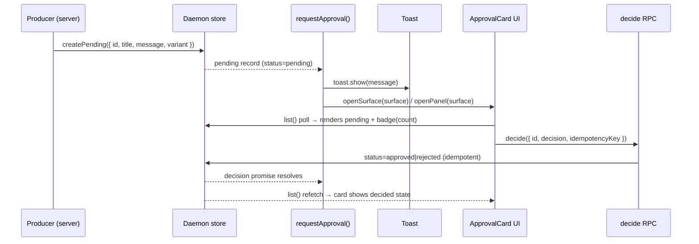
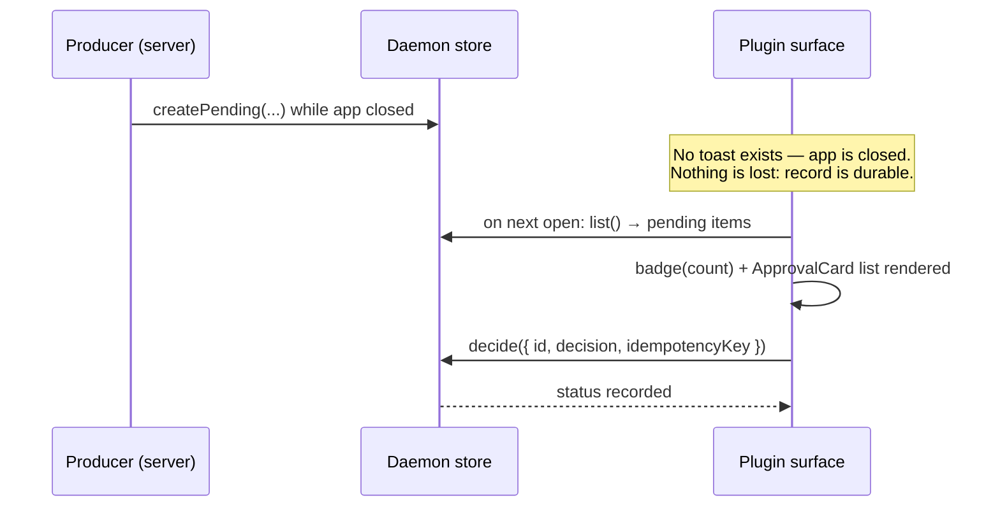

# Toast-to-Approval Flow Primitive

**Status:** specification (implements [Issue #48 (forge.mrs)](https://forge.mrs.aager.de/xpufx/paseo/issues/48))
**Scope:** `paseo-plugin-helper/client` + `paseo-plugin-helper/server` + docs
**Constraint:** No Paseo host/SDK changes. Provider-agnostic (gateway approvals,
destructive actions, pairing requests).

---

## 1. Problem statement

Plugin toasts are broadcast-only: `useToast().show(message)` carries no
actions and no click target, and the host exposes no push path into plugin UI.
Any OK/Deny flow therefore cannot live inside the toast.

Every plugin currently hand-rolls the same workaround: fire a toast, hope the
user navigates to the right surface, and wire an ad-hoc approve/reject RPC.
This spec defines one reusable helper primitive so the pattern is identical
everywhere.

Core rule — **split-surface approval**:

- **Toast announces.** Fire-and-forget, best-effort, no decision capability.
- **Plugin UI decides.** The pending decision lives in the plugin's own
  surface/panel/modal, where `Approve` / `Deny` buttons are wired to a typed
  RPC mutation.
- **Server records.** The decision is durable server-side state, never
  client-local, so it survives app close/reopen.

---

## 2. Goals / non-goals

### Goals

1. One client primitive — `requestApproval(client, options)` — that fires the
   announcement toast, optionally navigates, and returns a promise resolving
   to the recorded server decision.
2. One companion decision UI — `ApprovalCard` — built only from existing
   helper primitives (`ModalBody`, `Card`/`Card.Header`, `Badge`, `Button`,
   `EmptyState`, `useRpcQuery`/`useRpcMutation`).
3. One documented server contract shape — `defineRpc` approve/reject/list
   triple with idempotency key — plus a durable pending-approvals queue backed
   by `PluginStorage`.
4. Honest closed-app semantics: toast only exists while the app is open; the
   pending decision remains visible in the surface (badge/count) for later.

### Non-goals

- No actionable toasts, no deep-link click targets, no host push/notifications.
- No new Paseo SDK surface (`initClientHelpers` four-field shape unchanged).
- No plugin-specific logic in the helper (no gateway/pairing nouns in API
  names, props, or RPC method names).
- No implementation in this spec phase — API shapes and contracts only.

---

## 3. Architecture: split-surface approval

```
┌──────────────┐  event needing   ┌───────────────────┐  durable write  ┌──────────────┐
│  Server-side │  user decision   │  Plugin daemon    │ ───────────────▶ │ PluginStorage│
│  producer    │ ───────────────▶ │  (creates record, │   approvals.json │ approvals    │
│  (any)       │  createPending() │  status=pending)  │                  │ queue        │
└──────────────┘                  └────────┬──────────┘                  └──────────────┘
                                           │ RPC poll (useRpcQuery list)
              ┌────────────────────────────┼──────────────────────────────────┐
              │ CLIENT                     ▼                                  │
              │  ┌──────────────────┐  ┌──────────────────┐  ┌──────────────┐ │
              │  │ requestApproval()│  │ Toast (announce) │  │ Plugin UI    │ │
              │  │ 1. toast.show()  │─▶│ broadcast-only,  │  │ (decide):    │ │
              │  │ 2. openSurface()/│  │ no actions,      │  │ ApprovalCard │ │
              │  │    openPanel()   │  │ no click target  │  │ + badge/count│ │
              │  │ 3. return        │  └──────────────────┘  └──────┬───────┘ │
              │  │    decision      │                               │ useRpc   │
              │  │    promise       │                               │ Mutation │
              │  └──────────────────┘                               │ approve/ │
              └────────────────────────────┼────────────────────────┼─────────┘
                                           │  decision RPC          ▼
                                  ┌────────┴──────────┐  ┌───────────────────┐
                                  │  Plugin daemon    │  │ PluginStorage     │
                                  │  decide() handler │──│ status=approved/  │
                                  │  (idempotent)     │  │ rejected, decided │
                                  └───────────────────┘  │ At, idempotency   │
                                                         │ key dedupe        │
                                                         └───────────────────┘
```

Two independent read paths, one write path:

- **Announce path (ephemeral):** toast. May be missed. Never authoritative.
- **Decision path (durable):** `list` query → `ApprovalCard` → `decide`
  mutation → storage. Authoritative, pollable, survives restart.
- The `requestApproval()` promise bridges them for the caller that is alive:
  it resolves when the server records the decision, however the user reached
  the card (via navigation or on their own).

### Sequence: happy path (app open)



### Sequence: closed-app / missed-toast path



---

## 4. Client primitive: `requestApproval`

### 4.1 Signature

```ts
import type { MockClientContext } from "paseo-plugin-helper/testing";

export type ApprovalVariant = "info" | "warning" | "danger";
export type ApprovalDecision = "approved" | "rejected" | "expired";
export type ApprovalStatus = "pending" | ApprovalDecision;

export interface RequestApprovalOptions {
  id: string;
  title: string;
  message: string;
  variant?: ApprovalVariant;
  surface?: string;
  panel?: string;
  navigate?: boolean;
  timeoutMs?: number;
  idempotencyKey?: string;
}

export interface ApprovalHandle {
  id: string;
  idempotencyKey: string;
  decision: Promise<ApprovalDecision>;
  cancel(): void;
}

export function requestApproval(
  client: Pick<MockClientContext, "openSurface" | "openPanel">,
  options: RequestApprovalOptions,
): ApprovalHandle;
```

### 4.2 Semantics

1. **Toast first (best-effort).** Calls the host toast obtained from the
   `initClientHelpers` injection (`getClientHost().useToast().show(message)`)
   inside a `try/catch`. Toast failure never rejects the decision promise and
   never throws — the pending record is the source of truth, not the toast.
2. **Navigation second (opt-in).** When `surface` is set and
   `navigate !== false`, calls `client.openSurface(surface)`; when `panel` is
   set, calls `client.openPanel(panel)`. Both guarded with `typeof === 
   "function"` checks so SSR/tests with partial mock clients do not throw.
   When neither is set, or `navigate: false`, no navigation occurs and the
   caller keeps the returned handle (covers "leave navigation to the caller").
3. **Decision promise.** Resolves to the decision recorded by the server for
   `id`. Rejects only on timeout (`timeoutMs`, default: no timeout — pending
   is indefinite until decided or expired server-side) or explicit `cancel()`.
   The promise is a poll/subscription over the `list` contract, not a toast
   callback — there is no callback to wire because toasts have no actions.
4. **Idempotency key.** Defaults to a generated UUID (`crypto.randomUUID()`
   with a `Math.random` fallback for Hermes). A caller-supplied
   `idempotencyKey` is passed through to the `decide` mutation. Retried
   `requestApproval` calls for the same `id` reuse the stored record; they
   must not create duplicates (server enforces, §5.4).

### 4.3 Minimal usage

```tsx
import { requestApproval } from "paseo-plugin-helper/client";

const handle = requestApproval(client, {
  id: "pair-9f3a",
  title: "Pairing request",
  message: "Gateway gw-01 wants to pair. Review in the plugin surface.",
  variant: "warning",
  surface: "my-surface",
});

const decision = await handle.decision;
if (decision === "approved") {
  // proceed; server already recorded it
}
```

Navigation-deferred usage (caller navigates or stays put):

```tsx
const handle = requestApproval(client, {
  id: "wipe-cache",
  title: "Clear cache?",
  message: "This deletes 2.1 GB of cached tiles.",
  variant: "danger",
  navigate: false,
});
```

---

## 5. Server contract

### 5.1 RPC triple

Three contracts per approving domain, built with the existing `defineRpc`
from `paseo-plugin-helper/shared` (re-exported through server). Method names
are namespaced per plugin (`<plugin>:<domain>.<verb>`); the helper documents
the shape, never the literal names.

```ts
import { z } from "zod";
import { defineRpc } from "paseo-plugin-helper/shared";

export const ApprovalRecordSchema = z.object({
  id: z.string().min(1),
  title: z.string().min(1),
  message: z.string().min(1),
  variant: z.enum(["info", "warning", "danger"]).default("info"),
  status: z.enum(["pending", "approved", "rejected", "expired"]).default("pending"),
  idempotencyKey: z.string().min(1),
  createdAt: z.string().datetime(),
  updatedAt: z.string().datetime(),
  decidedAt: z.string().datetime().nullable().default(null),
  expiresAt: z.string().datetime().nullable().default(null),
  decidedBy: z.string().nullable().default(null),
});

export const ApprovalDecisionSchema = z.enum(["approved", "rejected"]);

export const approvalListContract = defineRpc({
  name: "<plugin>:approvals.list",
  input: z.object({
    status: z.enum(["pending", "approved", "rejected", "expired", "all"]).default("pending"),
    limit: z.number().int().min(1).max(100).default(50),
  }),
  output: z.object({ approvals: z.array(ApprovalRecordSchema) }),
});

export const approvalDecideContract = defineRpc({
  name: "<plugin>:approvals.decide",
  input: z.object({
    id: z.string().min(1),
    decision: ApprovalDecisionSchema,
    idempotencyKey: z.string().min(1),
  }),
  output: z.object({
    approval: ApprovalRecordSchema,
    duplicate: z.boolean().default(false),
  }),
});

export const approvalCreateContract = defineRpc({
  name: "<plugin>:approvals.create",
  input: z.object({
    id: z.string().min(1),
    title: z.string().min(1),
    message: z.string().min(1),
    variant: z.enum(["info", "warning", "danger"]).default("info"),
    idempotencyKey: z.string().min(1),
    ttlMs: z.number().int().positive().optional(),
  }),
  output: z.object({
    approval: ApprovalRecordSchema,
    duplicate: z.boolean().default(false),
  }),
});
```

Wire-up follows the existing `registerSettingsRpc(context, contract, storage)`
pattern: one `registerApprovalsRpc(context, { storage, hooks })` helper taking
a `PluginStorage` over the approvals file (see §6) and registering the three
handlers on the daemon `PluginContext`.

### 5.2 `decide` handler rules

1. Look up record by `id`. Unknown `id` → typed RPC error (`NOT_FOUND`); the
   client surfaces it via `useRpcMutation.onError`, never as a silent success.
2. If `status !== "pending"` → return current record with `duplicate: true`
   (no state change, no hook re-fire). Late/double taps are safe.
3. If a prior `decide` was recorded with the same `idempotencyKey` → return
   current record with `duplicate: true`.
4. Otherwise set `status`, `decidedAt` (now, ISO), `updatedAt`, persist
   atomically via `PluginStorage.write`, fire `onDecided(record)` once, return
   `{ approval, duplicate: false }`.
5. Expired records (`expiresAt` passed, see §5.3) transition to `expired` on
   read (`list`) and on `decide` attempt; a `decide` against an expired record
   returns the expired record with `duplicate: true`.

### 5.3 Expiry

- `ttlMs` at create time sets `expiresAt = createdAt + ttlMs`. Absent `ttlMs`
  means no expiry (pending is indefinite — the honest default for pairing and
  destructive-action gates).
- Expiry is lazy: evaluated on `list`/`decide` reads and on a best-effort
  periodic sweep (`createPeriodicTask`, existing server helper). No timers
  inside the helper client.
- `requestApproval({ timeoutMs })` is purely client-local (rejects the
  promise); it never mutates server state.

### 5.4 Duplicate-create rule

`create` with an `id` that already exists returns the existing record with
`duplicate: true` — it never overwrites a decided record and never resets a
pending one. Retried toast announces (app reopen, producer retry) are
therefore harmless.

---

## 6. Persistence & offline / closed-app handling

### 6.1 Durable queue

- Pending approvals persist in `PluginStorage("<plugin>", "approvals.json",
  { schema })` — atomic temp-file + rename writes, Zod-validated reads with
  defaults, same guarantees as all helper server state.
- Schema: `{ version: 1, approvals: ApprovalRecord[] }`, capped at 200 records
  (oldest decided first evicted; pending never evicted).
- The file is the single source of truth. No in-memory-only pending state
  anywhere in the flow.

### 6.2 Closed-app honesty

- Toasts exist only while the app is open. The spec assumes any toast fired
  while the app is closed is lost — and requires that nothing is lost with it.
- On every surface/panel open, the plugin runs `useRpcQuery(list, { status:
  "pending" })` and renders:
  - a **pending badge/count** (sidebar icon badge, surface header `Badge`, or
    pill label — plugin's choice, but one must exist), and
  - the `ApprovalCard` list (§7) for the pending items.
- Polling while open reuses `useAutoRefreshQuery` with `isOpen` gating so
  background polling halts when the surface closes (battery-safe, existing
  helper behavior).

### 6.3 Pending badge contract

```tsx
const { data } = useRpcQuery(approvalListContract, { status: "pending" });
const pendingCount = data?.approvals.length ?? 0;

// Surface header / sidebar:
{pendingCount > 0 && <Badge label={`${pendingCount} pending`} variant="warning" dot />}
```

Badge variant mapping: `pendingCount > 0` → `warning`; any
`variant: "danger"` pending → `danger`. Zero pending → badge hidden (never a
`0 pending` chip; matches `docs/surfaces.md` — absent data with a live source
renders placeholder-free hidden state, not a zero chip).

---

## 7. Companion decision UI: `ApprovalCard`

### 7.1 Composition (existing primitives only)

- Outer: `Card` (+ `Card.Header` with `title`, `icon`, status `Badge`).
- Body wrapper: `ModalBody` when rendered inside `Modal.Content`; plain `Card`
  content when rendered inline in a surface/panel (no nested scroller — honors
  the `ModalBody` host-scroll rule in `docs/client.md`).
- Actions: `Button label="Approve" variant="primary"` + `Button label="Deny"
  variant="danger"` (or `ghost` for deny when the pending item is `info`
  variant — caller's `denyVariant` prop, default `"danger"`).
- States: `useRpcMutation(decide)` for writes; `loading`/`disabled` wired to
  `isPending`; terminal states (`approved`/`rejected`/`expired`) render a
  status `Badge` instead of buttons.

### 7.2 Proposed props

```tsx
export interface ApprovalCardProps {
  approval: ApprovalRecord;
  decideContract: typeof approvalDecideContract;
  listQueryKey?: readonly unknown[];
  approveLabel?: string;
  denyLabel?: string;
  denyVariant?: "danger" | "ghost";
  onDecided?: (record: ApprovalRecord) => void;
}

export function ApprovalCard(props: ApprovalCardProps): ReactNode;

export interface ApprovalListProps {
  approvals: ApprovalRecord[];
  decideContract: typeof approvalDecideContract;
  listQueryKey?: readonly unknown[];
  emptyTitle?: string;
  emptyDescription?: string;
}

export function ApprovalList(props: ApprovalListProps): ReactNode;
```

`ApprovalList` renders `EmptyState` (icon `"Inbox"`, title `"No pending
approvals"`) for the empty case and maps non-empty to `ApprovalCard`s.
`listQueryKey` invalidates the `list` query on successful decide so badge
counts update without manual refetch.

### 7.3 Example surface wiring

```tsx
import {
  ModalBody, Card, Badge, Button, EmptyState,
  useRpcQuery, useRpcMutation,
} from "paseo-plugin-helper/client";

function ApprovalsSection() {
  const list = useRpcQuery(approvalListContract, { status: "pending" });
  const pending = list.data?.approvals ?? [];

  return (
    <Card>
      <Card.Header
        title="Approvals"
        icon="ShieldCheck"
        badge={pending.length > 0
          ? <Badge label={`${pending.length} pending`} variant="warning" dot />
          : undefined}
      />
      {pending.length === 0 ? (
        <EmptyState icon="Inbox" title="No pending approvals" />
      ) : (
        pending.map((approval) => (
          <ApprovalCard
            key={approval.id}
            approval={approval}
            decideContract={approvalDecideContract}
          />
        ))
      )}
    </Card>
  );
}
```

---

## 8. Lifecycle state machine

```
            create()                 decide(approved)      evict (cap)
  (absent) ──────────▶ PENDING ────────────────────────▶ APPROVED ───▶ (pruned)
                        │  ▲                                ▲
                        │  │ duplicate create /              │ decide(approved)
                        │  │ retry (no-op)                   │ on decided=no-op
                        ▼  │                                (duplicate:true)
                      EXPIRED ◀── ttl lapse (lazy, on read) ─┘
                        │
                        │ decide() on expired → returns expired,
                        │ duplicate:true, no mutation
                        ▼
                    (terminal; prunable)

  PENDING ──decide(rejected)──▶ REJECTED (terminal; prunable)
```

Invariants:

1. `create` never overwrites: existing `id` → `{ duplicate: true }`.
2. `decide` fires exactly once per record (`onDecided` once; late/double
   decisions return `duplicate: true` with no side effects).
3. Terminal states (`approved`/`rejected`/`expired`) are immutable.
4. Pending is never auto-evicted; only terminal records prune under the cap.

---

## 9. Error handling matrix

| Situation | Behavior |
|---|---|
| Toast throws / unavailable | Swallowed; decision promise unaffected |
| `openSurface`/`openPanel` missing (partial mock, old host) | Skipped via `typeof` guard; handle still returned |
| `decide` unknown `id` | Typed `NOT_FOUND` error → `onError` on mutation; buttons re-enable |
| Double-tap Approve / Approve-after-Deny | Second write returns `duplicate: true`; UI shows first decision |
| App closed before decision | Nothing lost; badge + card on next open (§6.2) |
| Record expires while card open | Next `list` poll flips card to expired badge; buttons unmount |
| Storage write fails | `decide` returns error; record stays `pending`; retry safe via same `idempotencyKey` |

---

## 10. Testing plan

- **Client:** `createMockClientContext` + injected `useToast`/`useRpc` doubles.
  Assert toast called with `message`; navigation called/skipped per options;
  toast throw does not reject; `cancel()` rejects; missing `openSurface`
  does not throw.
- **Server:** temp-dir `PluginStorage`; assert create-duplicate no-op,
  decide idempotency (`duplicate: true`, single `onDecided`), unknown-id
  error, lazy expiry flip, 200-record cap never evicts pending.
- **UI:** `ApprovalCard` with mocked `useRpcMutation`; assert buttons →
  mutation args `{ id, decision, idempotencyKey }`, `isPending` disables both,
  terminal record renders badge not buttons, empty list renders `EmptyState`.
- **Closed-app:** seed storage with pending records, cold-start surface,
  assert badge count + card list render with zero toasts fired.

---

## 11. Open questions (implementation phase)

1. Should `registerApprovalsRpc` live in `paseo-plugin-helper/server` (like
   `registerSettingsRpc`) or stay a documented pattern each plugin copies?
   Recommendation: helper-owned, same file conventions as settings.
2. Should `requestApproval`/`ApprovalCard` ship in `client/index.ts` root or a
   `client/approvals.tsx` subpath import? Recommendation: subpath
   (`paseo-plugin-helper/client/approvals`) to keep root bundle lean, matching
   the `custom-pills` precedent.
3. Polling vs subscription for the decision promise: poll `list` at 1–2s while
   pending (simple, no host changes) vs host event subscription if a future
   SDK exposes one. Recommendation: poll now; leave a subscription seam.

---

## 12. Acceptance criteria

- [ ] `requestApproval` fires broadcast toast, navigates per options, returns
      cancelable decision promise; toast/navigation failures never corrupt state.
- [ ] `ApprovalCard`/`ApprovalList` built only from `ModalBody`, `Card`,
      `Badge`, `Button`, `EmptyState`, `useRpcQuery`/`useRpcMutation`.
- [ ] Server triple (`create`/`list`/`decide`) documented with Zod schemas and
      idempotency-key rules; duplicate/unknown/expired behaviors as specified.
- [ ] Pending queue durable in `PluginStorage`; pending badge/count renders on
      surface open with zero toasts; closed-app path covered by test.
- [ ] `initClientHelpers` shape unchanged; zero new Paseo SDK imports in helper.
