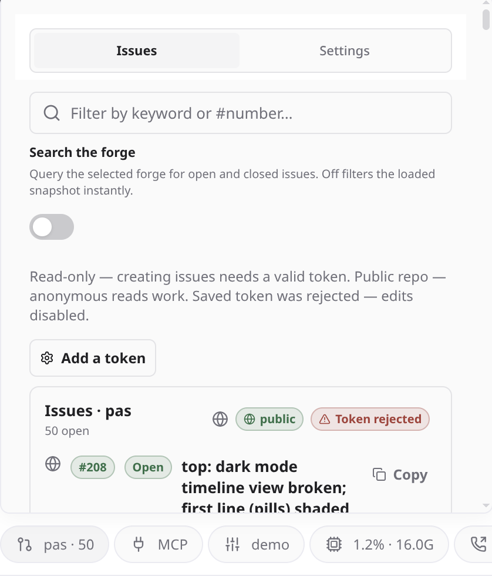
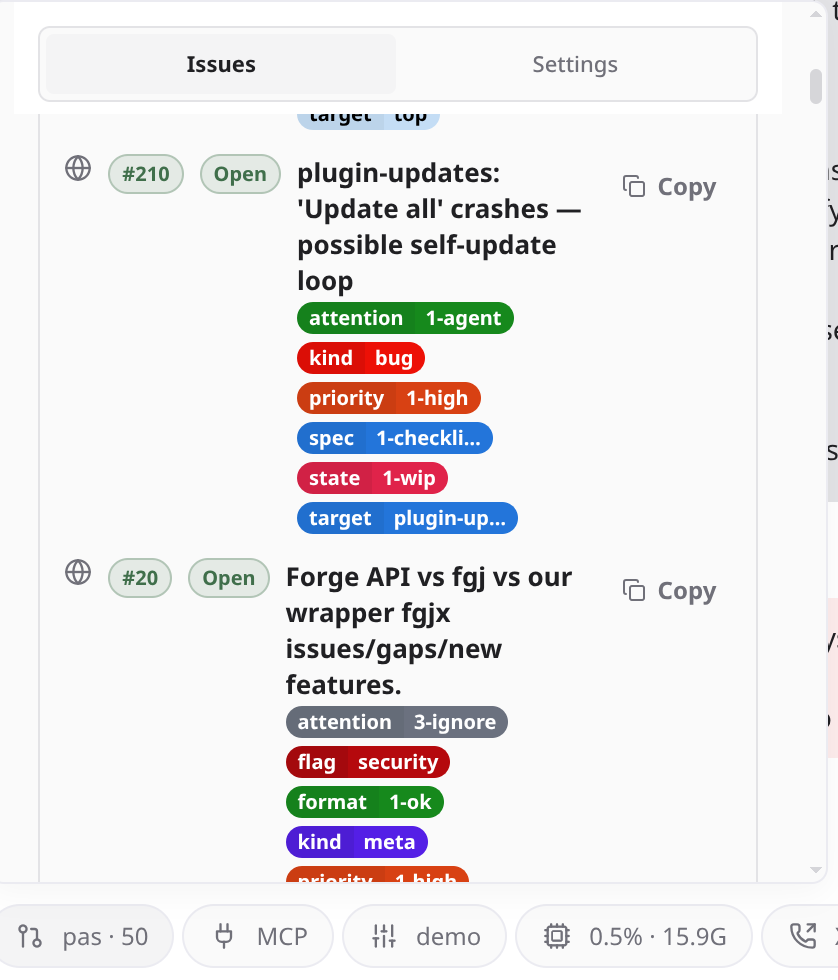
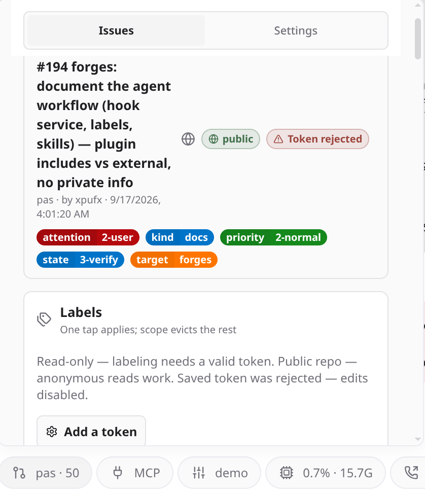

# forges

Work with Forge/Gitea-family issues from inside Paseo: list open issues for the
repo backing a workspace, read an issue's body and comments (with parsed agent
envelopes), change scoped labels, and post comments, all in plugin surfaces
with no browser. Augment with the provided webhook bridge and scoped labels
to unlock autonomous agent orchestration.

Pull requests, releases, actions, and everything else are out of scope for now.

Built on [paseo-plugin-helper](https://github.com/xpufx/paseo/tree/main/packages/paseo-plugin-helper), the shared Paseo plugin runtime.

## Screenshots

| Main | Issue List | Issue Detail |
| :---: | :---: | :---: |
|  |  |  |

## Highlights

- **No CLI dependency.** All forge access goes through an embedded TypeScript
  `fetch` client (`server/forge-client.ts`) against the Gitea-family
  `/api/v1`. There is no `git`/`fgj`/`fgjx` subprocess and no dependency on any
  host dotfile.
- **Daemon-side tokens.** The API token is stored per host in plugin settings
  and only ever attached to `fetch` calls in the daemon. It never reaches the
  client.
- **Live label vocabulary.** Scopes are derived from the labels actually on the
  board, so a foreign board degrades gracefully instead of failing on an
  unknown scope.
- **Paged reads.** Issue list, keyword search, label list, and comment list are
  all collections: each call returns **one page**, and the default page size is
  **server-defined and can change**. Treat every list as paged
  (`limit`/`page`, or follow `Link`/`X-Total-Count`) instead of assuming a
  single call is complete; one unpaged call is never evidence of "no results".
  A surface that lists results should page internally rather than render a
  truncated set (#189).
- **Example skills.** Our agent workflow ships under `examples/` as a starting
  point to adapt (see [`examples/README.md`](./examples/README.md)).

Supported forges (verified live, anonymous reads): any Forgejo/Gitea-family
host, including Forgejo, Gitea, and Codeberg.

## Workflow Augmentation: Turn Issues into Agent Fleet Automation

Out of the box, `forges` gives you in-app issue management, scoped label chips, and steering comments directly inside Paseo.

When augmented with our scoped label taxonomy and lightweight webhook bridge ([`examples/hook-service/`](./examples/hook-service/)), `forges` becomes an autonomous agent coordination layer:

- **Automated Webhook Ingestion:** New issues, label edits, or comments on your forge immediately dispatch events to your orchestrator agent via Paseo's agent transport.
- **Autonomous Agent Handoffs:** Coding agents pick up assigned tickets, transition `state/` chips (`0-triage` → `1-wip` → `2-review` → `3-verify` → `4-done`), publish structured status envelopes, and pass attention back to the operator when human signoff is required.
- **Drop-In Scoped Label Taxonomy:** Seed our four core scopes (`state/`, `priority/`, `attention/`, `spec/`) using the generic template in [`examples/labels/label-base.yaml`](./examples/labels/label-base.yaml).
- **Adaptable Agent Skills:** Ships with zero-CLI skills (using plugin `/api/v1` RPCs directly) as well as CLI-assisted workflows ([`examples/skills/`](./examples/skills/)).

See [`docs/workflow.md`](./docs/workflow.md) for the end-to-end architecture and [`examples/README.md`](./examples/README.md) for starter templates.

## Install

The plugin uses the Paseo 0.8 layout (`index.client.tsx` / `index.server.ts`
entries, `client/` / `server/` / `shared/` split, manifest
`requirements.paseo >= 0.8.0`).

```sh
paseo plugin add xpufx/paseo --path plugins/forges
```

Or from a local monorepo checkout:

```sh
paseo plugin add ./plugins/forges
```

## Configuration

Open the plugin's **Settings** tab inside a workspace.

- **Active forge.** Each workspace watches one active forge at a time. The
  list holds the workspace's forge remotes (any `parseForgeRemote` form plus
  a bare `owner/repo`); **Auto** derives the remote from the workspace's git
  `origin`. An explicit selection wins absolutely: an invalid or unreachable
  selection fails loudly instead of silently deriving.
- **API token.** Saved per host in daemon-side plugin settings. Reads work
  anonymously on public repos; labels and comments need an accepted token with
  write scope on both public and private repos. For Forgejo/Gitea create the
  PAT with `read:user`, `read:repository`, and `write:issue` (add
  `write:repository` if label management still 403s). Edit capability is read
  from the repo's permission object (`permissions.push`/`admin`, or GitLab
  `access_level >= 30`), so a token that is accepted but under-scoped shows
  "token lacks write scope" instead of enabling edits.

## Development

```sh
npm install --workspace=plugins/forges
npm run typecheck --workspace=plugins/forges
npm test --workspace=plugins/forges
```

The helper audit also applies:

```sh
node packages/paseo-plugin-helper/bin/paseo-plugin-helper.js audit plugins/forges
```

See [`docs/specs/forge-workflow-gui.md`](./docs/specs/forge-workflow-gui.md)
for the data model, RPC contracts, and UI surfaces, and
[`docs/workflow.md`](./docs/workflow.md) for the end-to-end agent workflow
(hook service, label usage, agent responsibilities, and what the plugin ships
versus what an adopter supplies).
