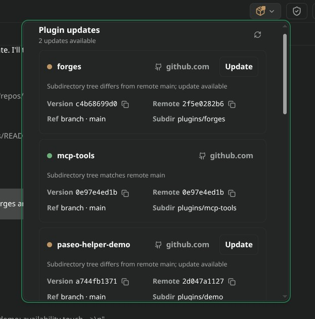
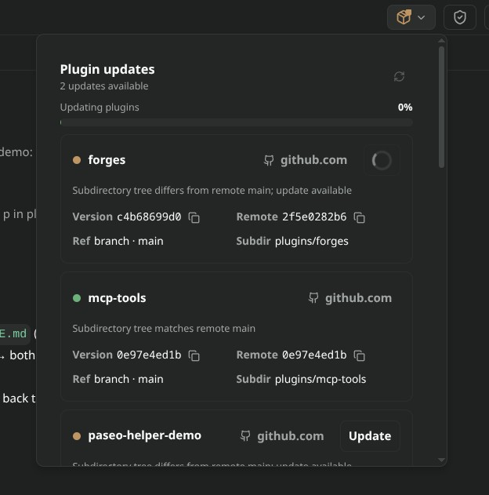

# plugin-updates

Git-source update monitor and updater for [Paseo](https://github.com/getpaseo/paseo) plugins (v0.8+).

<table align="center">
  <tr>
    <td align="center"><strong>main</strong><br></td>
    <td align="center"><strong>updating</strong><br></td>
  </tr>
</table>

Adds a header button to every workspace that opens a popover listing the installed plugins. Each row reports whether the plugin's installed git source is current, behind, pinned, missing, or has no upstream, and offers a one-click update when a pullable change exists.

> [!NOTE]
> **Prerequisites & Platform Support**:
> - Zero install requirements: the helper runtime is vendored (`client|server|shared/vendor/paseo-plugin-helper/`, pinned helper 0.4.0-beta.12), so Paseo installs this plugin with no build step and no npm/registry access. For local `typecheck` and `test`, Node.js (v18+) is enough.
> - The system `git` CLI must be available, because update checks and pulls shell out to `git`.
> - Developed and tested primarily on **Linux**.

## Core Capabilities

### 1. Workspace Header Button
- Registers a header button once per workspace, titled **Plugin updates**, that opens a popover listing every installed plugin.
- The button shows a refresh glyph while a check is running, and a status dot in the corner: green when everything is fresh, amber while checking or when an update is available, and red when a check fails.

### 2. Per-plugin Git Status
Each row resolves the plugin to its git repository root, ref, and subdirectory, then probes the remote to classify the install:

- **current**: the local commit or subdirectory tree matches the tracked ref, or the local checkout is ahead of the remote.
- **behind**: the remote ref has commits the local checkout does not, so an update is available.
- **pinned**: the install is pinned to a fixed tag or commit. Pinned installs are report only; nothing is ever pulled for them.
- **no-upstream**: no upstream remote is configured, or the tracked branch or tag no longer exists on the remote.
- **missing**: the remote is reachable but the plugin subdirectory does not exist at the tracked ref.
- **unpinned**: a detached HEAD, or a managed install with no recorded ref. Report only.
- **not-a-repo**: the plugin is not a git checkout, so no git update is possible.
- **error**: the check itself failed, for example because the remote was unreachable.

### 3. Per-subdirectory Scoping
- Plugins installed from a monorepo subpath track only that subdirectory tree. A commit that touches other paths in the same repository does not register as an update.
- The row shows the resolved **Subdir** (`(repo root)` when the plugin is the repository root), alongside the local and remote tree hashes and the tracked ref.

### 4. Source Links
- Each row resolves a browsable source URL from the remote the plugin was installed from, falling back to `package.json` `repository` and `homepage` metadata when no install remote exists.
- GitHub, GitLab, and unknown forges get an appropriate glyph, and links deep-link into the subdirectory for GitHub (`/tree/<ref>/<subdir>`) and Forgejo/Gitea-style (`/src/branch/<ref>/<subdir>`) hosts.
- A `dirty` badge appears on a directory install when the plugin scope has uncommitted changes.

### 5. Update Action
- Available updates show an **Update** button in the row. After a failed pull that needs an override, the button becomes **Force update**.
- **git-managed installs** delegate to `paseo plugin update <id>`.
- **directory (path-linked) installs** resolve the repository root and run a fast-forward `git pull`. The pull is refused when the working tree is dirty unless forced, and refused when the local branch has diverged from its upstream.
- After a successful pull, every plugin that shares the same repository root is reloaded.
- When more than one plugin has an update, an **Update all** button appears. If any failure requires an override, **Force update all** is offered instead.

### 6. Orphaned Directory Flagging
- Directories left behind in Paseo's managed plugin location by an uninstalled or failed install are listed in a separate **Orphaned directories** section with a name and path.
- Orphans are reported only; they are never probed or updated.

### 7. Live Refresh
- The popover re-checks on a 30 second interval and on demand through the refresh button, and reports the available update count in its header.

## Installation

Install from the public monorepo subpath (GitHub shorthand):

```sh
paseo plugin add xpufx/paseo --path plugins/plugin-updates
```

> [!NOTE]
> Bare `owner/repo` shorthand resolves against **GitHub** only. For any other forge, pass the full git URL instead, for example `https://git.example.com/owner/repo`.

For local development:

```sh
git clone https://github.com/xpufx/paseo.git
cd paseo
paseo plugin add ./plugins/plugin-updates
```

## Usage & Configuration

- No settings are required. The header button registers automatically in each workspace that has an agent session.
- Open the button to see installed plugins, their status, and available updates, then use the row **Update** button or **Update all** to pull and reload.
- Checks run against the plugin's install remote only, so a fork or mirror installed as the source is what gets compared.
- Pulls run with `--ff-only`. A dirty working tree or a diverged branch must be reconciled manually before an update can apply.

## Limitations

- **Local git installs** have no recorded install ref, so status comes from a working-tree comparison rather than a known version. Use a git remote + subpath for ref-based tracking.

## Development

```sh
# Typecheck
npm run typecheck --workspace=plugins/plugin-updates

# Typecheck plus the test suite (tsx --test)
npm run test --workspace=plugins/plugin-updates

# Reload in a running Paseo daemon
paseo plugin reload plugin-updates
paseo plugin logs plugin-updates
```

## License

MIT
