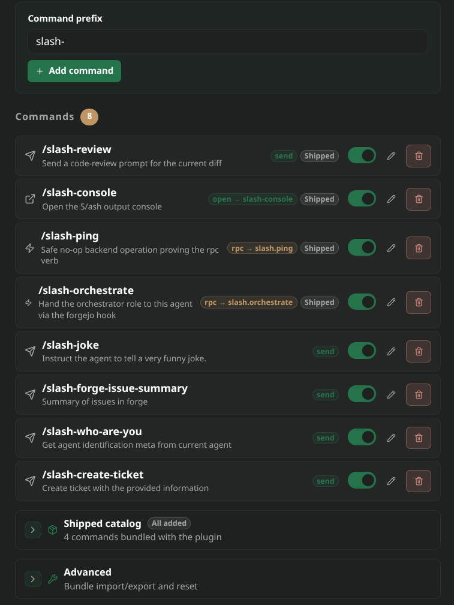
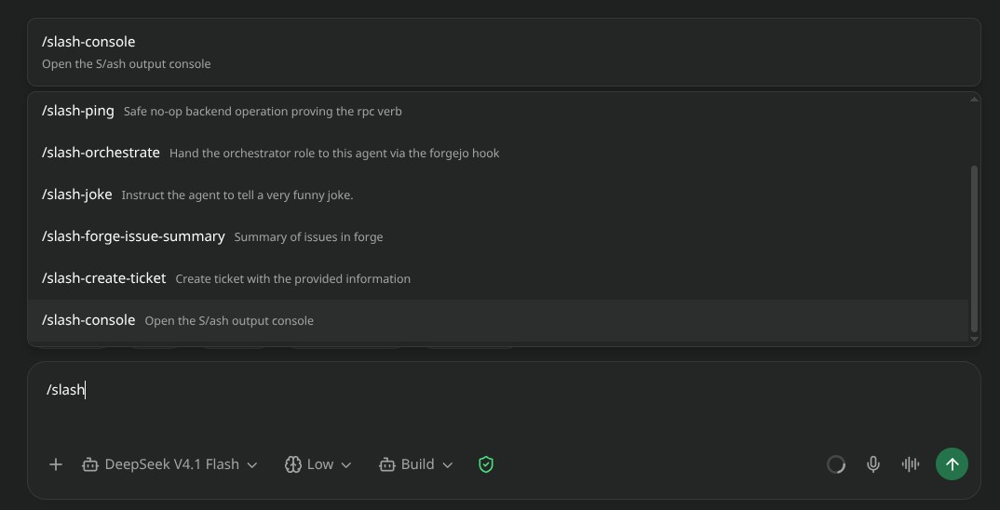

# s/ash

Slash-command console for [Paseo](https://github.com/getpaseo/paseo) (v0.8+).

<p align="center">
  
</p>

<p align="center">
  
</p>

Adds a **S/ash console** sidebar surface for managing the slash commands offered
in the composer, and keeps those commands registered as the repository changes.
A command carries one of three actions:

- **send** — interpolate `{args}` into a prompt template and send it to the agent.
- **open** — open a named plugin surface.
- **rpc** — run an allowlisted daemon operation (shipped: `slash.ping`, `slash.echo`).

Built on [paseo-plugin-helper](https://github.com/xpufx/paseo/tree/main/packages/paseo-plugin-helper), the shared Paseo plugin runtime.

> [!NOTE]
> **Prerequisites & Platform Support**:
> - Developed and tested primarily on **Linux**.

## What it does

- **Command repository.** The console lists enabled commands with their action
  summary and supports add / edit / remove through helper form primitives.
- **Shipped catalog.** The seed commands (`review`, `console`, `ping`) are
  listed separately so a missing one can be added back with one tap.
- **Prefix.** An optional shared prefix (default `slash-`, clearable to render
  bare command names) is applied to every command name.
- **Bundle import/export.** Enabled commands round-trip through a versioned
  `slash-commands` document, so a command set can be shared between machines.

## RPC contracts (`shared/resources.ts`)

- `slash.settings`: persisted `prefix` and command repository.
- `slash.commands.list`: enabled commands with the prefix applied.
- `slash.catalog.list`: the shipped seed catalog, without touching settings.
- `slash.commands.run`: run one command by name; `send`/`open` resolve
  client-side, `rpc` executes daemon-side.
- `slash.bundle.export` / `slash.bundle.import`: share command sets as a
  versioned bundle.

## Install

```sh
paseo plugin add xpufx/paseo --path plugins/slash
```

## Development

```sh
npm run typecheck --workspace=plugins/slash
npm test --workspace=plugins/slash
```
