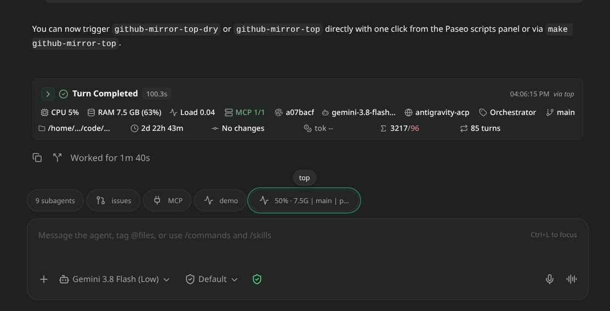
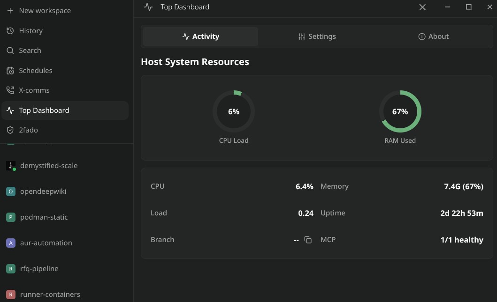
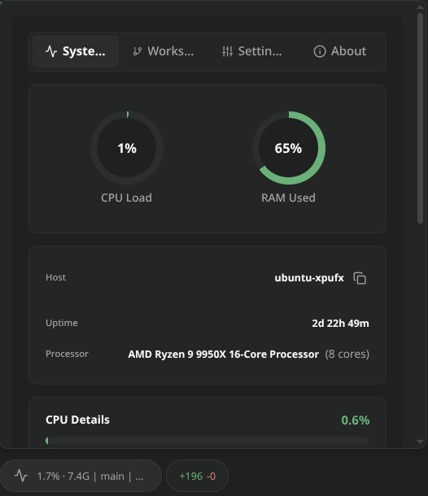
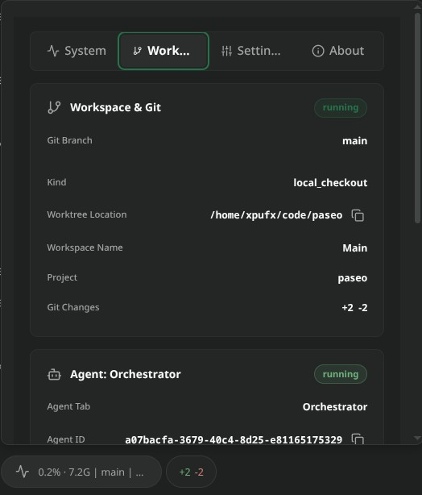
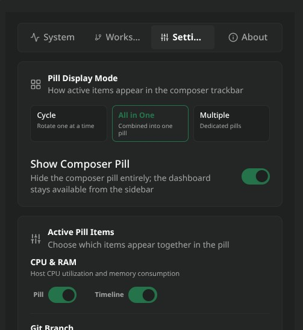
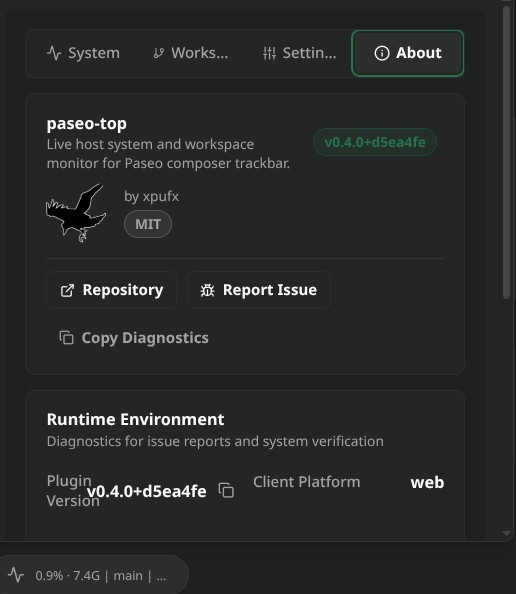

# paseo-top

Live host system resource monitor and telemetry provider for [Paseo](https://github.com/getpaseo/paseo) (v0.8+).

Displays real-time host metrics, session metadata, turn telemetry, and custom pill widgets directly in the composer track bar without cluttering the interface. Automatically stamps performance summaries into agent conversation timelines and provides an interactive modal dashboard with live gauges.

> [!NOTE]
> **Prerequisites & Platform Support**:
> - Zero install requirements: the helper runtime is vendored (`client|server|shared/vendor/paseo-plugin-helper/`, pinned helper 0.4.0-beta.12 — see `shared/vendor/paseo-plugin-helper/README.md`), so Paseo installs this plugin with no build step and no npm/registry access. For local development (`typecheck`/`test`), Node.js (v18+) is enough.
> - Developed and tested primarily on **Linux** (using `/proc` telemetry), with fallback support for **macOS** and **Windows** host platforms.

| General Composer View | Dashboard View |
| :---: | :---: |
| [](screenshots/paseo-top-general-view.jpg) | [](screenshots/paseo-top-dashboard.jpg) |

| System Resources Modal | Workspace Context Modal | Settings Modal | About Modal |
| :---: | :---: | :---: | :---: |
|  |  |  |  |


## Core Capabilities

### 1. Host Resource Telemetry
- **CPU & Memory Tracking**: Continuous utilization monitoring with Linux `/proc/meminfo` available-RAM accuracy.
- **Load Averages & Architecture**: Reports 1m, 5m, and 15m load averages, physical and logical CPU core counts, platform architecture, and host uptime.
- **Three-Tier Status Indicators**:
  - **Success / Normal**: Below 60% CPU and 70% RAM.
  - **Warning / Elevated**: 60% to 84% CPU or 70% to 84% RAM.
  - **Danger / Critical**: 85% or higher CPU or RAM.
- **Adaptive Polling**: Throttles telemetry refresh rates when the modal is closed to conserve CPU cycles.

### 2. Workspace & Agent Session Context
- **Git Branch & Worktree**: Monitors active branch name and worktree directory path.
- **Git Diff Shortstats**: Summarizes uncommitted file changes, lines added, and lines deleted.
- **Agent Identity**: Displays active agent session ID, display name, model name, and LLM provider.
- **Agent Activity State**: Reflects lifecycle state (running, idle, waiting for input).

### 3. Turn Telemetry & Token Accounting
- **Lifetime Turn Counter**: Tracks conversation turn counts throughout the session.
- **Token Accounting**: Captures input tokens, cached prompt tokens, output tokens, and context window utilization percentage.
- **Cost Estimation**: Reports cumulative estimated USD cost per turn when supported by the provider.
- **Tool Execution Auditing**: Counts tool invocations and execution error tallies per turn.
- **Timeline Turn Telemetry**: Automatically appends a structured telemetry card to the conversation timeline at the conclusion of each agent turn.

### 4. Fleet & MCP Integration
- **MCP Server Health**: Bridges with `mcp-tools` to monitor connected MCP servers, distinguishing healthy, degraded, or offline servers alongside latency figures.

### 5. Flexible Display Modes
- **Cycle Mode**: Automatically cycles through enabled metric segments on each refresh interval.
- **All Mode**: Combines all enabled metrics into a single unified ticker.
- **Multiple Mode**: Splits selected metrics into distinct, individual pills placed side-by-side in the composer track bar.

> [!NOTE]
> Displaying too many pills separately in Multiple Mode may cause UI performance issues. Consider using **Cycle Mode** or **All Mode** when monitoring multiple metrics simultaneously.

### 6. Dual Surface Routing Matrix
Every metric can be routed independently via settings to:
- **Pill**: Render in the composer track bar.
- **Timeline**: Render in the turn completion card.
- **Both**: Display in both locations.
- **None**: Disable the metric entirely.

### 7. Extensible Custom Metric Pills (JSONC Engine)
Add user-defined metrics by dropping declarative `.jsonc` definitions into `~/.paseo/xpufx-plugins/top/pills/`:
- **Shell Command Execution**: Executes commands or scripts at configurable intervals.
- **Threshold Matching**: Maps outputs or exit codes to visual statuses (`neutral`, `success`, `warning`, `danger`, `accent`, `info`).
- **Interactive Modal Drilldown**: Clicking a custom pill can trigger an on-demand secondary command (for example, `docker ps -a` or `df -h`) and render terminal output directly inside the detail modal.
- Built-in templates available in [`examples/pills/`](examples/pills/):
  - `docker-containers.jsonc`: Active container tally and list
  - `gpu-nvidia.jsonc`: GPU load and VRAM usage via `nvidia-smi`
  - `disk-usage.jsonc`: Root filesystem utilization meter
  - `battery.jsonc`: Battery percentage and AC charging state
  - `git-dirty.jsonc`: Modified file count in working tree

### 8. Native Modal Dashboard
Clicking the pill opens a native dashboard with:
- **Pinned Header Navbar**: Fixed tabs for System Resources, Activity Timeline, Custom Pills, Settings, and About. Content smoothly scrolls beneath the navbar.
- **Visual Gauges**: Responsive bars showing CPU and RAM distribution.
- **Full Settings Suite**: Live toggles for every metric and pill, with persistent state managed by `PluginStorage`.

## Installation

Install using the native Paseo monorepo subpath syntax:

```bash
paseo plugin add xpufx/paseo --path plugins/top
```

For local development:

```bash
git clone git@github.com:xpufx/paseo.git
cd paseo
paseo plugin add ./plugins/top
```

## Development

```bash
# Typecheck
npm run typecheck --workspace=plugins/top

# Run test suite
npm test --workspace=plugins/top

# Reload in a running Paseo daemon
paseo plugin reload top
paseo plugin logs top
```

## License

MIT
