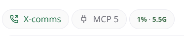

# paseo-top

<p align="center">
  
  <br /><br />
  
</p>

Live host system resource monitor and telemetry provider for [Paseo](https://github.com/getpaseo/paseo) (v0.8+).

Displays real-time host metrics (CPU, memory, load averages) right in the composer track bar without cluttering the interface, powers detailed timeline telemetry cards at the end of agent turns, and provides an extensible custom-pill engine via JSONC configs.

## Features

- **Composer Pill**: Unobtrusive live telemetry widget in the composer track bar directly above the agent prompt.
- **Three-Tier Status Colors**:
  - 🟢 **Green** (`statusSuccess`): Normal load (< 60% CPU, < 70% RAM).
  - 🟠 **Orange** (`statusWarning`): Elevated usage (60%–84% CPU, 70%–84% RAM).
  - 🔴 **Red** (`statusDanger`): Critical usage (≥ 85% CPU or RAM).
- **Native Modal Dialog**: Click the pill to open a detailed breakdown with responsive gauges:
  - CPU utilization with load averages (1m, 5m, 15m) and core counts.
  - Memory usage (used vs total, percentage, Linux `/proc/meminfo` available-RAM accuracy).
  - Host info (hostname, platform, CPU model & architecture, system uptime).
  - Continuous live polling while open, with adaptive throttling when minimized.
- **Custom Metric Pills (JSONC)**: Extend the track bar with bespoke user metrics defined via declarative JSONC files in `~/.paseo/xpufx-plugins/top/pills/` (e.g. Docker container counts, battery level, Nvidia GPU load, dirty git files, disk usage).
- **Timeline Turn Telemetry**: Automatically stamps turn metrics (tokens, tool call counts, git diff shortstats, model/provider identity) directly into agent conversation history.
- **Suite Settings Screen**: Granular toggles to independently enable/disable pill segments, timeline telemetry cards, and custom pills with shared suite settings persistence.

## Installation

Install directly with the Paseo CLI using the monorepo subpath:

```bash
paseo plugin add xpufx/paseo --path plugins/top
```

Or for local development from a clone:

```bash
git clone git@github.com:xpufx/paseo.git
cd paseo
paseo plugin add ./plugins/top
```

Once installed, it is listed as `top` in `paseo plugin ls`.

## Custom Metric Pills

Top supports drop-in custom pills written in JSONC. Example templates can be found in [`examples/pills/`](examples/pills/):

- `docker-containers.jsonc` — Active Docker container count
- `gpu-nvidia.jsonc` — GPU memory and utilization via `nvidia-smi`
- `disk-usage.jsonc` — Root filesystem capacity gauge
- `battery.jsonc` — Laptop battery charge level and AC state
- `git-dirty.jsonc` — Working tree uncommitted file counter

Drop any `.jsonc` definition into `~/.paseo/xpufx-plugins/top/pills/` to automatically register the pill on next reload.

## Development

```bash
# Typecheck top
npm run typecheck --workspace=plugins/top

# Run unit test suite
npm test --workspace=plugins/top

# Reload plugin in a running Paseo daemon
paseo plugin reload top
paseo plugin logs top
```

## License

MIT
